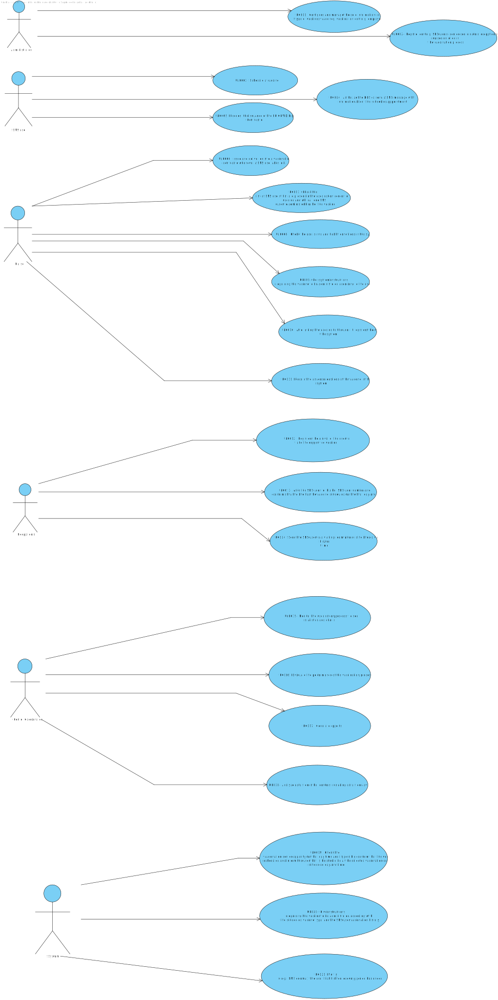

# Use Case Diagram (UCD)

**In the scope of this project, there is a direct relationship of _1 to 1_ between Use Cases (UC) and User Stories (US).**

However, be aware, this is a pedagogical simplification. On further projects and curricular units might also exist _1 to N **and/or** N to 1 relationships between US and UC.

**Insert below the Use Case Diagram in a SVG format**

**For each UC/US, it must be provided evidences of applying main activities of the software development process (requirements, analysis, design, tests and code). Gather those evidences on a separate file for each UC/US and set up a link as suggested below.**

# Use Cases / User Stories
| UC/US  | Description                                                               |                   
|:----|:------------------------------------------------------------------------|
| UC 001 | Configure and manage the core information (e.g.:type of vaccines, vaccines, vaccination centers, employees) |
| UC 002 | Register centers, SNS Users, center coordinators, receptionists, and nurses enrolled in the vaccination process |
| UC 003 | Schedule a vaccine |
| UC 004 | Authorize the DGS to send  a SMS message with information about the scheduled appointment |
| UC 005 | Request the issuance of the EU COVID Digital Certificate |
| UC 006 | Issue and deliver on site a vaccination certificate whenever a SNS user asks for it |
| UC 007 | Check the list of SNS users that are present in the vaccination center to take the vaccine and will call one SNS user to administer him/her the vaccine |
| UC 008 | Check the user's info and health condition in the system |
| UC 009 | Get system instructions regarding the vaccine to be administered according to the user's info |
| UC 010 | After giving the vaccine to the user, it registers the event in the system |
| UC 011 | Record the adverse reactions of the vaccine in the system |
| UC 012 | Registers the arrival of the user to take the respective vaccine |
| UC 013 | Asks the SNS user for his/her SNS user number and confirms that he/she has the vaccine scheduled for the that day and time |
| UC 014 | Send the SNS user to a waiting room where (s)he should wait for his/her time |
| UC 015 | Monitor the vaccination process, to see statistics and charts |
| UC 016 | Evaluate the performance of the vaccination process |
| UC 017 | Generate reports |
| UC 018 | Analyze data from other centers, including data from law systems |
| UC 019 | Check the vaccination center capacity for that day/time and, if possible, confirm that the vaccination is scheduled and inform the user that (s)he should be at the selected vaccination center at the scheduled day and time |
| UC 020 | Give instructions regarding the vaccine to be administered according with the scheduled vaccine type, and the SNS user vaccination history |
| UC 021 | Notify (e.g.: SMS or email) the user that his/her recovery period has ended |