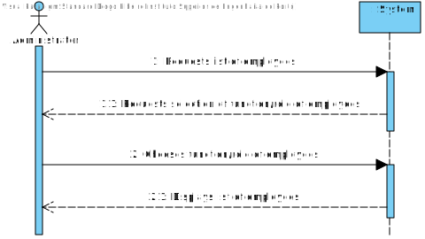
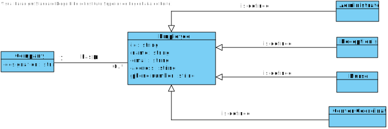
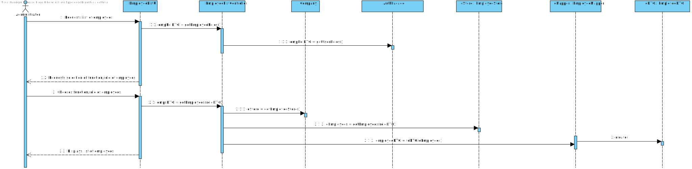
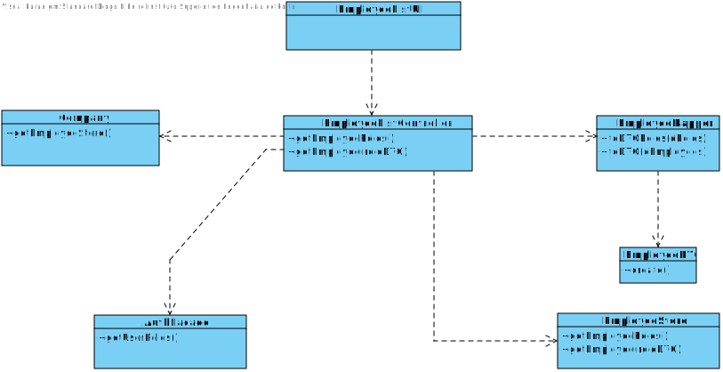
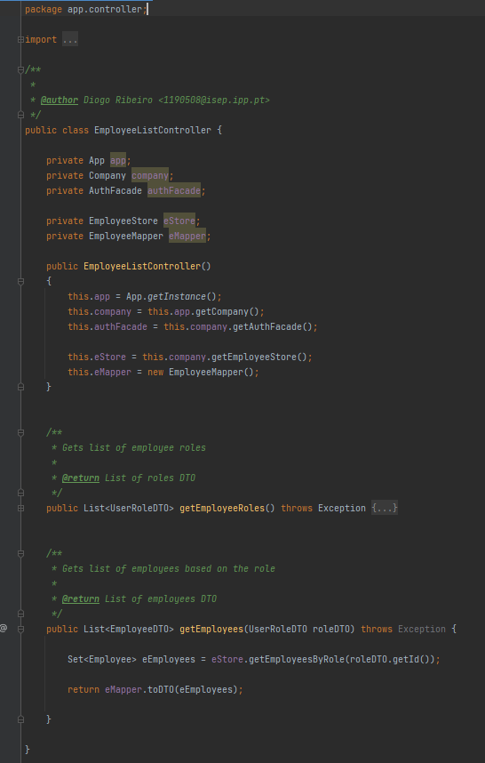
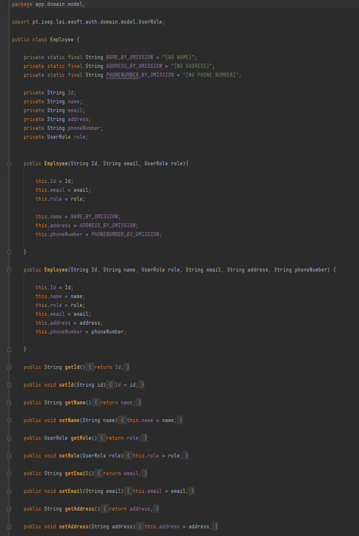

# US 011 - To get a list of employees with a given function/role

## 1. Requirements Engineering

### 1.1. User Story Description

As an administrator, I want to get a list of Employees with a given function/role.

### 1.2. Customer Specifications and Clarifications 

**From the specifications document:**

> The application must allow the user to choose a specific role/function in order to filter the list of employees.

**From the client clarifications:**

> **Question:** Besides the name of the employee, what other attributes do we need to show on the list? Can we show every single attribute, including password and username?
>
> **Answer:** The application should present all Employee attributes.
Password is not an Employee attribute.

-

> **Question:** Should we give the user the possibility of listing employees from more than 1 role?
>
> **Answer:** The Administrator should select a given role and all employees associated with the selected role should be listed.

-

> **Question:** Should the list be sorted in any specific way(for example alphabetical name order) or should we give the option to sort by other characteristics?
>
> **Answer:** For now I just want to get a list of employees without considering the order of presentation.

### 1.3. Acceptance Criteria

* **AC1:** User must be a administrator.
* **AC2:** User must be logged in.
* **AC3:** There must be roles created.

### 1.4. Found out Dependencies

N/A

### 1.5 Input and Output Data

**Input Data:**
	
* Selected data:
	* Role

**Output Data:**

* (In)Success of the operation
* List of Roles
* List of Employees

### 1.6. System Sequence Diagram (SSD)

**Other alternatives might exist.**

### 1.7 Other Relevant Remarks

N/A

## 2. OO Analysis

### 2.1. Relevant Domain Model Excerpt 

### 2.2. Other Remarks

N/A

## 3. Design - User Story Realization 

### 3.1. Rationale

| Interaction ID | Question: Which class is responsible for... | Answer                 | Justification (with patterns)  |
|:---------------|:--------------------- |:-----------------------|:---------------------------- |
| Step 1  		     |	... interacting with the actor? | EmployeeListUI         |  Pure Fabrication: there is no reason to assign this responsibility to any existing class in the Domain Model.           |
| Step 2	  		    |	... coordinating the US? | EmployeeListController | Controller                             |
| Step 3  		     |	...retriving all the Roles? | AuthFacade             | IE: has registed all Roles  |
| Step 4 		      |	 ...retriving all the Employees? | EmployeeStore          | IE: has registed all Employees  |
| Step 5  		     |	... presenting the information? | EmployeeListUI         | IE: is responsible for user interactions.| 
| Step 6  		     |	... informing operation success?| EmployeeListUI         | IE: is responsible for user interactions.  | 

### Systematization ##

According to the taken rationale, the conceptual classes promoted to software classes are: 

 * Company
 * Role
 * Employee

Other software classes (i.e. Pure Fabrication) identified: 

 * EmployeeListUI 
 * EmployeeListController 
 * EmployeeStore
 * AuthFacade

## 3.2. Sequence Diagram (SD)

## 3.3. Class Diagram (CD)

# 4. Tests 

# 5. Construction (Implementation)

## Class EmployeeListController 

## Class Employee

# 6. Integration and Demo 

# 7. Observations

