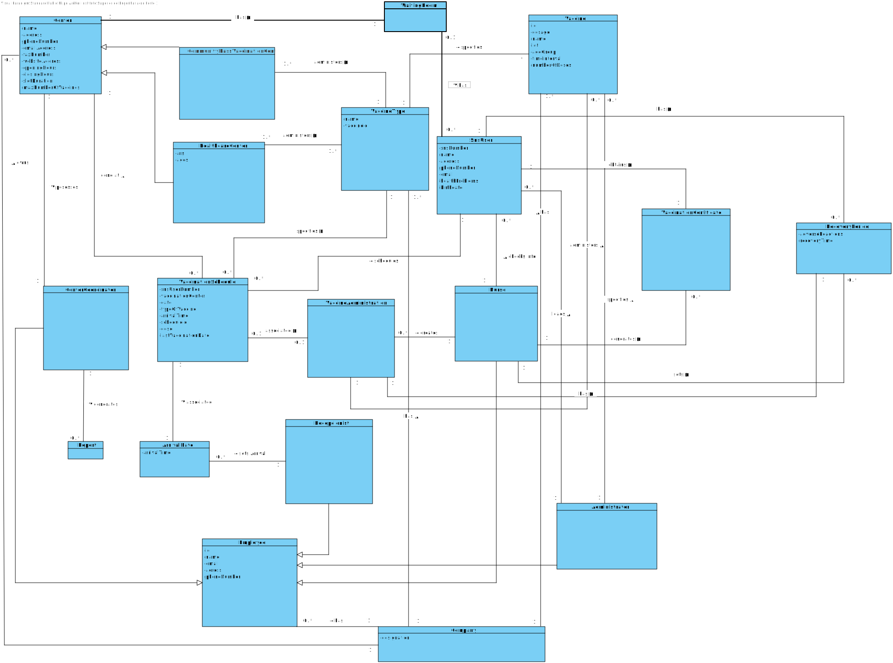

# OO Analysis #

The construction process of the domain model is based on the client specifications, especially the nouns (for _concepts_) and verbs (for _relations_) used. 

## Rationale to identify domain conceptual classes ##
To identify domain conceptual classes, start by making a list of candidate conceptual classes inspired by the list of categories suggested in the book "Applying UML and Patterns: An Introduction to Object-Oriented Analysis and Design and Iterative Development". 

### _Conceptual Class Category List_ ###

* Center
* Vaccination Center
* Healthcare Center
* Vaccine Type
* SNS User
* Vaccine
* Vaccination certificate
* Nurse
* Administrator
* Receptionist
* Center Coordinator
* Employee
* Vaccination Schedule
* Report
* Vaccine administration
* Recovery period
* Company
* Arrival Date

**Business Transactions**

* HealthCare Center and Vaccination Center administers Vaccine Type
* Nurse generates Vaccination Certificate

---

**Transaction Line Items**

* Report 

---

**Product/Service related to a Transaction or Transaction Line Item**

* EU Covid Digital certificate
* Vaccine

---

**Transaction Records**

* 

---  

**Roles of People or Organizations**

* Nurse checks info of SNS User and generates Vaccination Certificate
* Receptionist sets arrival 
* Center Coordinator posesses Center
* SNS User schedules Vaccination Schedule and obtains Vaccination Certificate

---

**Places**

* Vaccination Center
* HealthCare Center

---

** Noteworthy Events**

* SNS User schedules Vaccination Schedule
* HealthCare Center and Vaccination Center administers Vaccine Type
* Receptionist sets arrival of Vaccination Schedule
* Nurse generates Vaccination Certificate
* Center Coordinator generates Report

---

**Physical Objects**

*

---

**Descriptions of Things**

* Vaccine
* Vaccination Certificate

---

**Catalogs**

*  Report

---

**Containers**

*  Vaccination Schedule holds information of SNS User

---

**Elements of Containers**

*  

---

**Organizations**

* ARS
* AGES
* DGS
* SNS

---

**Other External/Collaborating Systems**

*  

---

**Records of finance, work, contracts, legal matters**

* Report
* Vaccination Certificate

---

**Financial Instruments**

*  

---

**Documents mentioned/used to perform some work/**

* 
---

###**Rationale to identify associations between conceptual classes**###

An association is a relationship between instances of objects that indicates a relevant connection and that is worth of remembering, or it is derivable from the List of Common Associations: 

+ **_A_** is physically or logically part of **_B_**
+ **_A_** is physically or logically contained in/on **_B_**
+ **_A_** is a description for **_B_**
+ **_A_** known/logged/recorded/reported/captured in **_B_**
+ **_A_** uses or manages or owns **_B_**
+ **_A_** is related with a transaction (item) of **_B_**
+ etc.

| Concept (A) 		    |  Association   	|  Concept (B) |
|----------	   		    |:-------------:	|------:       |
|Center	 	            |posesses           |Center Coordinator
|Vaccination Center     |is defined         |Center
|Vaccination Center     |administers        |Vaccine Type
|HealthCare Center      |is defined         |Center
|HealthCare Center      |administers        |Vaccine Type
|Vaccine Type           |specifies          |Vaccine
|SNS User    		    |has                |Recovery Period
|SNS User     		    |obtains            |Vaccination Certificate
|SNS User     		    |schedules          |Vaccination Schedule
|Center Coordinator     |generates          |Report
|Center Coordinator     |is defined         |Employee
|Vaccination Schedule   |done at            |Center
|Vaccination Schedule   |specifies          |Vaccine Type
|Vaccination Schedule   |associated         |Vaccine Administration
|Vaccination Schedule   |associated         |Arrival Date
|Vaccine Administration |administers        |Vaccine 
|Nurse                  |creates            |Vaccine Administration
|Nurse                  |checks info        |SNS User
|Nurse                  |generates          |Vaccination Certificate
|Nurse                  |sets               |Recovery Period
|Nurse                  |is defined         |Employee
|Receptionist           |sets arrival       |Arrival Date
|Receptionist           |is defined         |Employee
|Administrator          |is defined         |Employee
|Company                |owns               |Center
|Company                |has                |Employee
|Administrator          |loads              |SNS User

## Domain Model

**Do NOT forget to identify concepts atributes too.**

**Insert below the Domain Model Diagram in a SVG format**

