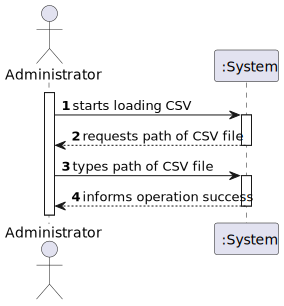
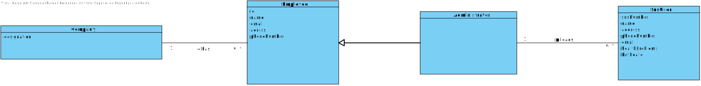
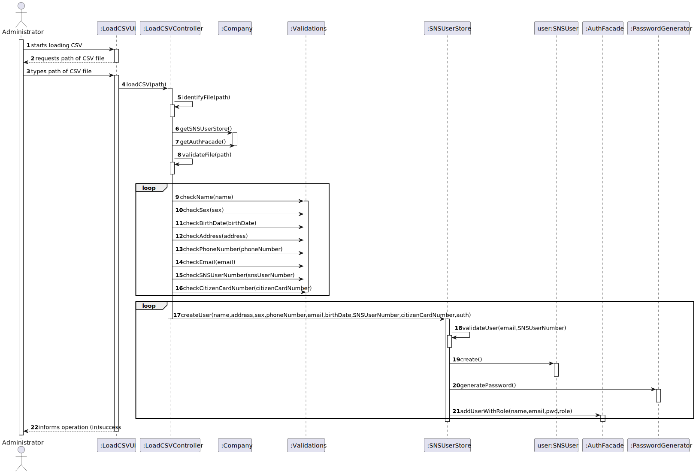
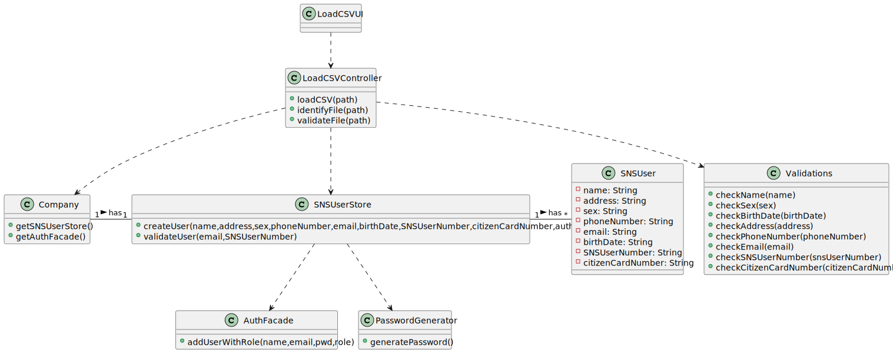

# US 14

## 1. Requirements Engineering

### 1.1. User Story Description

*As an administrator, I want to load a set of users from a CSV file.*

### 1.2. Customer Specifications and Clarifications 

**From the specifications document:**

N/A

**From the client clarifications:**

* Q: Regarding US014, I would like to clarify if the CSV file only contains information about SNS users of if the CSV file may also contain some information about employees from that vaccination center.
* A: The CSV file only contains information about SNS users.

* Q: What would be the sequence of parameters to be read on the CSV? For example: "Name | User Number.
* A: Name, Sex, Birth Date, Address, Phone Number, E-mail, SNS User Number and Citizen Card Number.

* Q: When the admin wants to upload a CSV file to be read, should the file be stored at a specific location on the computer (e.g. the desktop) or should the admin be able to choose the file he wants to upload in a file explorer?
* A: The Administrator should write the file path. In Sprint C we do not ask students to develop a graphical user interface.

* Q: Is it possible that the file can contain lines with incomplete information in some fields (e.g. N/A). If so, should we read those lines as well and leave those fields empty or shall we discard that complete line?
* A: CSV files that have errors should not be loaded. Opcional attributes may have a NA value.

* Q: In witch format will be given the date of birth (YYYY/MM/DD or DD/MM/YYYY)
* A: In a previous clarification I said: "The dates registered in the system should follow the Portuguese format (dd/mm/yyyy)".

* Q: Should our application detect if the CSV file to be loaded contains the header, or should we ask the user if is submitting a file with a header or not?
* A: The application should automatically detect the CSV file type.

* Q: What should the system do if the file to be loaded has information that is repeated? For example, if there are 5 lines that have the same information or that have the same attribute, like the phone number, should the whole file be discarded?
* A: If the file does not have other errors, all records should be used to register users. The business rules will be used to decide if all file records will be used to register a user.
  For instance, if all users in the CSV file are already registered in system, the file should be processed normally but no user will be added to the system (because the users are already in the system).

* Q: Should we check if the users from the CSV file are already registered in the system? If so, which data should we use, the one already in the system or the one on the file?
* A: This feature of the system will be used to register a batch users. If the user is already registered in the system, then the information available in the CSV file should not be used to register that user.

* Q: is there any specific format that should be validated for the address, or we can assume it is just of string type?
* A: The address contained in the CSV file is a string and should not contain commas or semicolons.

* Q: This question also regards the attribute sex, is the format "F"/"M"/ "N/A", or "female"/"male"/"N/A" , or a different, or can it be any?
* A:  From a previous answer we get "Opcional attributes may have a NA value".

* Q: how should the admin receive the login data/passwords for all registered users?
* A: During this sprint, login and password data should be presented in the console application.
  In US14 the application is used to register a batch of users. For each user, all the data required to register a user should be presented in the console.

* Q: Are there any SNS User attributes that can be omitted?
* A: I already answered one question related to US3 that answers your question. The Sex attribute is optional (it can also take the NA value). All other fields are required

* Q: On the last meeting you said that header contains names of the attributes that are listed in the file. My question is what is the delimiter for the header? Does it have points between words, commas or something else?
* A: Each type of CSV file has only one delimiter character.
  Acceptance criteria for US14: The application must support importing two types of CSV files: a) one type must have a header, column separation is done using “;” character; b) the other type does not have a header, column separation is done using “,” character.

### 1.3. Acceptance Criteria

* **AC1:** The application must support importing two types of CSV
* **AC2:** One type must have a header, column separation is done using “;” character
* **AC3:** The other type does not have a header, column separation is done using “,” character
* **AC4:** The CSV file must be correct, no errors are allowed or it won't be loaded
* **AC5:** The User can only be registered once in the system

### 1.4. Found out Dependencies

*Depends on the US3 because in order for the success of loading a CSV with users, it needs to have a class SNS User to create and register him in the system*

### 1.5 Input and Output Data

**Input Data:**

* Typed data:
  * File path

* Selected data:
  * N/A 

**Output Data:**
	
* (in)success of operation
* data required for the register of the users

### 1.6. System Sequence Diagram (SSD)

### 1.7 Other Relevant Remarks

N/A

## 2. OO Analysis

### 2.1. Relevant Domain Model Excerpt 

### 2.2. Other Remarks

N/A

## 3. Design - User Story Realization 

### 3.1. Rationale

| Interaction ID | Question: Which class is responsible for... | Answer  | Justification (with patterns)  |
|:-------------  |:--------------------- |:------------|:---------------------------- |
|   		 |...interacting with the actor?|LoadCSVUI|Pure Fabrication|
|   		 |...coordinating the US?|LoadCSVController|Controller|
| Step 1  		 |...start loading the CSV file?|n/a||
| Step 2  		 |...requesting the path of the CSV file?|LoadCSVUI|IE: responsible for user interaction|
| Step 3  		 |...typing the CSV file path?|n/a||
|   		 |...loading the CSV?|LoadCSVController|Controller: reads the CSV line by line|
|   		 |...identifying the type of the file?|LoadCSVController|Controller: reads the CSV line by line and identifies if it is separated by comma or semicolon|
|   		 |...returning the SNSUserStore and AuthFacade?|Company|IE: owns the store|
|   		 |...validating the file?|LoadCSVController|Controller: reads the file line by line and if identifies any error, the CSV won't be loaded|
|   		 |...validating the data read?|Validations|IE: validates the attributes required to create a user|
|  		 |...validating a User?|SNSUserStore|IE: searchs for the user in the system and will add if he's not registered yet|
|  		 |...creating a user?|SNSUser|Creator: The object created has its own data.|
|  		 |...generating a random Password?|PasswordGenerator|IE: generates a random password required for the authentication of the user |
|  		 |...adding the user?|AuthFacade|IE: adds the user to the auth facade using the name, email and password randomly generated|
| Step 4  		 |...informing operation (in)success|LoadCSVUI|IE: responsible for user interaction|              

### Systematization ##

According to the taken rationale, the conceptual classes promoted to software classes are: 

 * Company
 * SNSUser

Other software classes (i.e. Pure Fabrication) identified: 
 
 * LoadCSVUI  
 * LoadCSVController
 * SNSUserStore
 * AuthFacade
 * PasswordGenerator
 * Validations

## 3.2. Sequence Diagram (SD) 

## 3.3. Class Diagram (CD)

# 4. Tests 

# 5. Construction (Implementation)

# 6. Integration and Demo 

# 7. Observations

