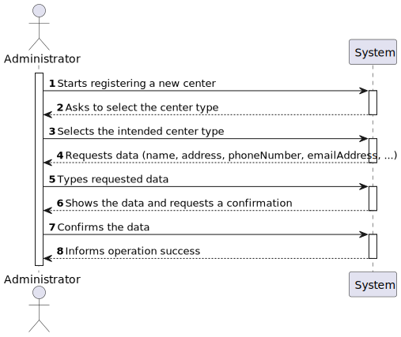
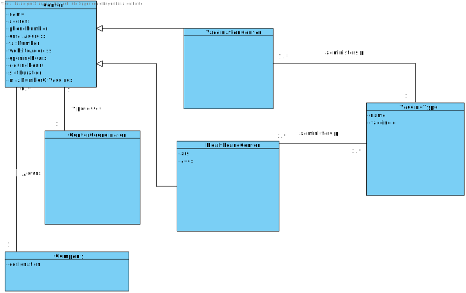
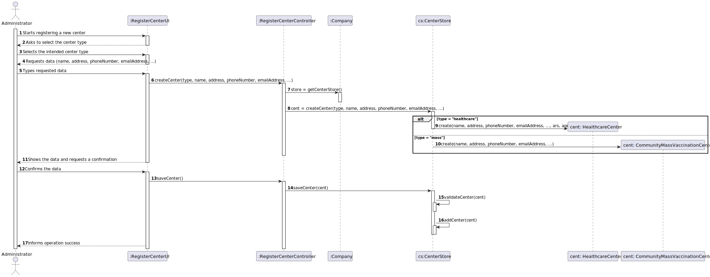
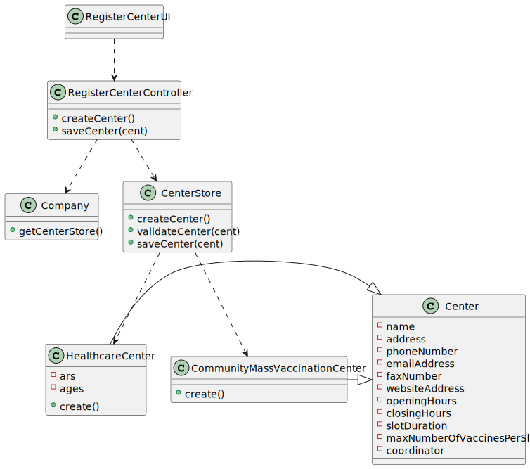

# US 9 - To register a vaccination center 

## 1. Requirements Engineering

### 1.1. User Story Description

As an administrator, I want to register a vaccination center to respond to a certain pandemic.

### 1.2. Customer Specifications and Clarifications 

**From the specifications document:**

>	The main difference between the two kinds of centers is
that a healthcare center is associated with a given ARS (Administração Regional de Saúde) and
AGES (Agrupamentos de Centros de Saúde), and it can administer any type of vaccines (e.g.:
Covid-19, Dengue, Tetanus, smallpox).

>	Both kinds of vaccination centers are characterized by a name, an address, a phone number, an e-mail address, a
fax number, a website address, opening and closing hours, slot duration (e.g.: 5 minutes) and the
maximum number of vaccines that can be given per slot (e.g.: 10 vaccines per slot). In addition,
each vaccination center has one coordinator.

**From the client clarifications:**

N/A

### 1.3. Acceptance Criteria

N/A

### 1.4. Found out Dependencies

* There is a dependency to "US12 Specify a new vaccine type" since vaccination centers must have at least 1 vaccine type.

### 1.5 Input and Output Data

**Input Data:**

* Typed data:
    * a center type, 
    * a name, 
    * an address,
    * a phone number,
    * an email address,
    * an opening hour,
    * a closing hour,
    * a slot duration,
    * a maximum number of vaccines per slot
* Selected data:
	* Add a new center

**Output Data:**

* List of center types
* (In)Success of the operation

### 1.6. System Sequence Diagram (SSD)

### 1.7 Other Relevant Remarks

N/A

## 2. OO Analysis

### 2.1. Relevant Domain Model Excerpt 

### 2.2. Other Remarks

N/A

## 3. Design - User Story Realization 

### 3.1. Rationale

| Interaction ID | Question: Which class is responsible for... | Answer  | Justification (with patterns)  |
|:-------------  |:--------------------- |:------------|:---------------------------- |
| Step 1  		 |	... interacting with the actor? | RegisterCenterUI   |  Pure Fabrication: there is no reason to assign this responsibility to any existing class in the Domain Model.           |
| 			  		 |	... coordinating the US? | RegisterCenterController | Controller                             | | | |
| Step 2  		 |							 |             |                              |
| Step 3  		 |	 |   |   |
| Step 4  		 |	 |   |  |
| Step 5  		 |	... saving the input data?  | HealthcareCenter / CommunityMassVaccinationCenter  | IE: object created in step 1 has its own data  |
| Step 6			  		 |	... presenting the information? | RegisterCenterUI | IE: is responsible for user interactions.|
| Step 7  		 |				...validating all data?			 |       CenterStore      |              IE: knows all its centers                | 
|							 |      ...saving the created center?       |              CenterStore                | IE: owns all its centers
| Step 8  		 |	... informing operation success?| RegisterCenterUI  | IE: is responsible for user interactions.  | 

### Systematization ##

According to the taken rationale, the conceptual classes promoted to software classes are: 

 * Company
 * Center
 * CommunityMassVaccinationCenter
 * HealthcareCenter

Other software classes (i.e. Pure Fabrication) identified: 

 * RegisterCenterUI  
 * RegisterCenterController
 * CenterStore

## 3.2. Sequence Diagram (SD)

## 3.3. Class Diagram (CD)

# 4. Tests 

# 5. Construction (Implementation)

## Class RegisterCenterController

    package app.controller;
    
    import app.controller.stores.CenterStore;
    import app.domain.model.Center;
    import app.domain.model.Company;
    
    public class RegisterCenterController {
    
        private App app;
        private Company company;
    
        private CenterStore cStore;
    
        public RegisterCenterController() {
            this.app = App.getInstance();
            this.company = this.app.getCompany();
    
            this.cStore = this.company.getCenterStore();
        }
    
        public Center createCenter(String type, String name, String address, String phoneNumber, String emailAddress, String faxNumber, String websiteAddress, double openingHours, double closingHours, double slotDuration, int maxNumberOfVaccinesPerSlot, String ars, String ages) {
            return cStore.createCenter(type, name, address, phoneNumber, emailAddress, faxNumber, websiteAddress, openingHours, closingHours, slotDuration, maxNumberOfVaccinesPerSlot, ars, ages);
        }
    
        public boolean saveCenter(Center cent) {
            return cStore.saveCenter(cent);
        }
    
    }

## Class Center

    package app.domain.model;
    
    public class Center {
    
    
        private String name;
        private String address;
        private String phoneNumber;
        private String emailAddress;
        private String faxNumber;
        private String websiteAddress;
        private double openingHours;
        private double closingHours;
        private double slotDuration;
        private int maxNumberOfVaccinesPerSlot;
        private CenterCoordinator coordinator;
    
        public Center(String name, String address, String phoneNumber, String emailAddress, String faxNumber, String websiteAddress, double openingHours, double closingHours, double slotDuration, int maxNumberOfVaccinesPerSlot) {
            this.name = name;
            this.address = address;
            this.phoneNumber = phoneNumber;
            this.emailAddress = emailAddress;
            this.faxNumber = faxNumber;
            this.websiteAddress = websiteAddress;
            this.openingHours = openingHours;
            this.closingHours = closingHours;
            this.slotDuration = slotDuration;
            this.maxNumberOfVaccinesPerSlot = maxNumberOfVaccinesPerSlot;
        }
    
        public String getName() {
            return name;
        }
    
        public void setName(String name) {
            this.name = name;
        }
    
        public String getAddress() {
            return address;
        }
    
        public void setAddress(String address) {
            this.address = address;
        }
    
        public String getPhoneNumber() {
            return phoneNumber;
        }
    
        public void setPhoneNumber(String phoneNumber) {
            this.phoneNumber = phoneNumber;
        }
    
        public String getEmailAddress() {
            return emailAddress;
        }
    
        public void setEmailAddress(String emailAddress) {
            this.emailAddress = emailAddress;
        }
    
        public String getFaxNumber() {
            return faxNumber;
        }
    
        public void setFaxNumber(String faxNumber) {
            this.faxNumber = faxNumber;
        }
    
        public String getWebsiteAddress() {
            return websiteAddress;
        }
    
        public void setWebsiteAddress(String websiteAddress) {
            this.websiteAddress = websiteAddress;
        }
    
        public double getOpeningHours() {
            return openingHours;
        }
    
        public void setOpeningHours(double openingHours) {
            this.openingHours = openingHours;
        }
    
        public double getClosingHours() {
            return closingHours;
        }
    
        public void setClosingHours(double closingHours) {
            this.closingHours = closingHours;
        }
    
        public double getSlotDuration() {
            return slotDuration;
        }
    
        public void setSlotDuration(int slotDuration) {
            this.slotDuration = slotDuration;
        }
    
        public int getMaxNumberOfVaccinesPerSlot() {
            return maxNumberOfVaccinesPerSlot;
        }
    
        public void setMaxNumberOfVaccinesPerSlot(int maxNumberOfVaccinesPerSlot) {
            this.maxNumberOfVaccinesPerSlot = maxNumberOfVaccinesPerSlot;
        }
    
        public CenterCoordinator getCoordinator() {
            return coordinator;
        }
    
        public void setCoordinator(CenterCoordinator coordinator) {
            this.coordinator = coordinator;
        }
    }

# 6. Integration and Demo 

# 7. Observations

