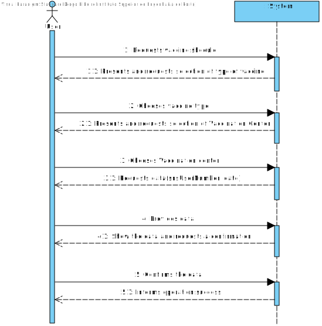
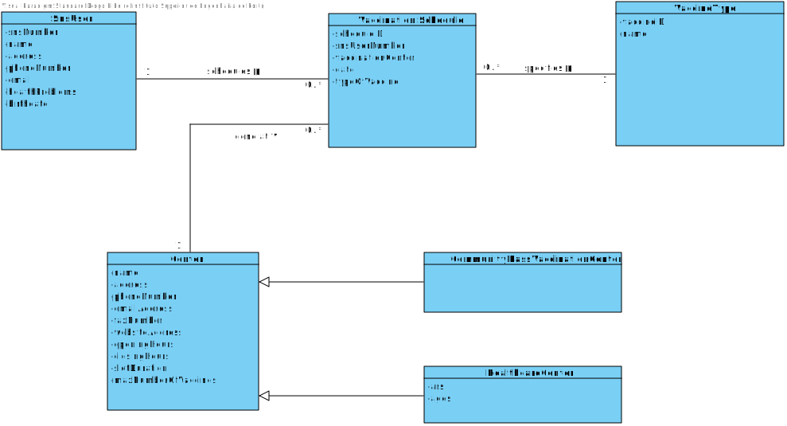
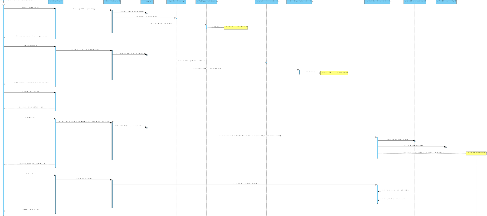
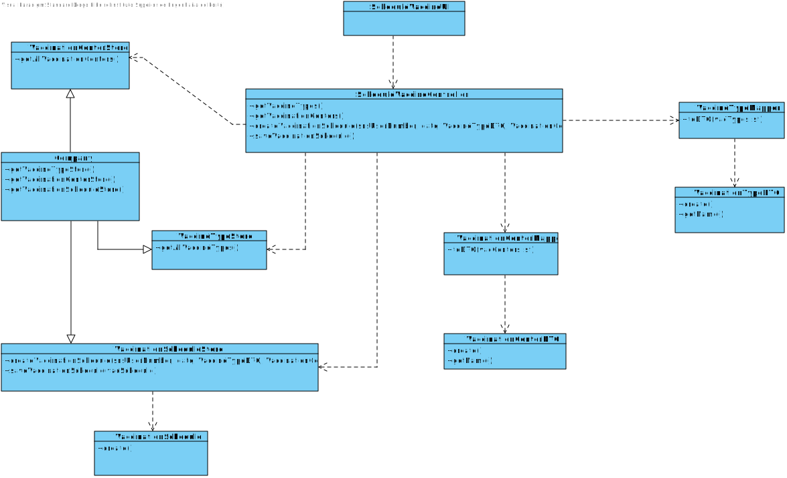
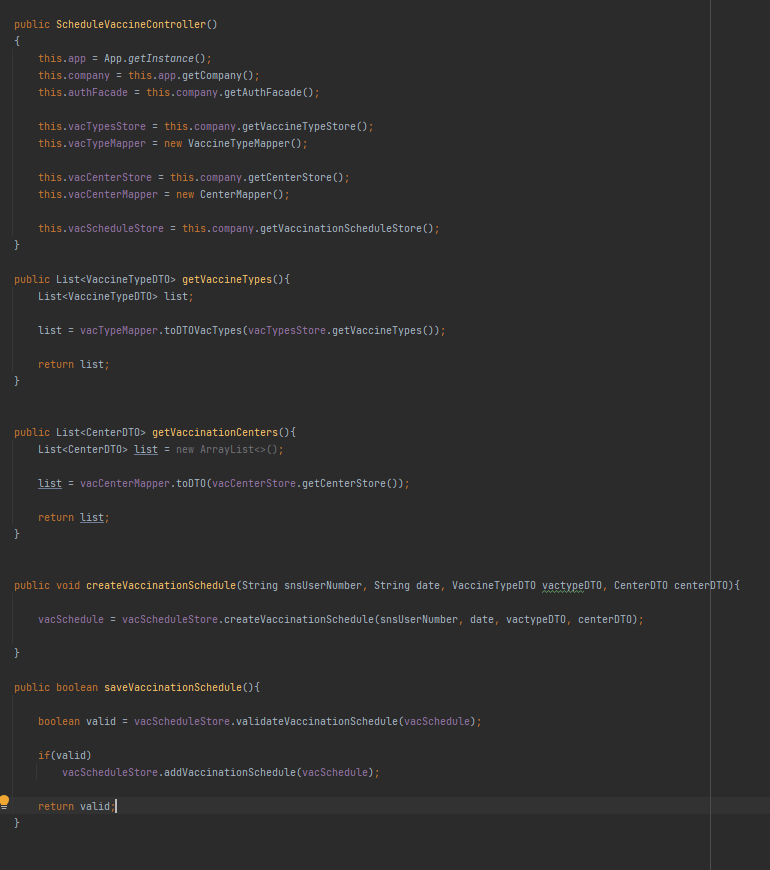
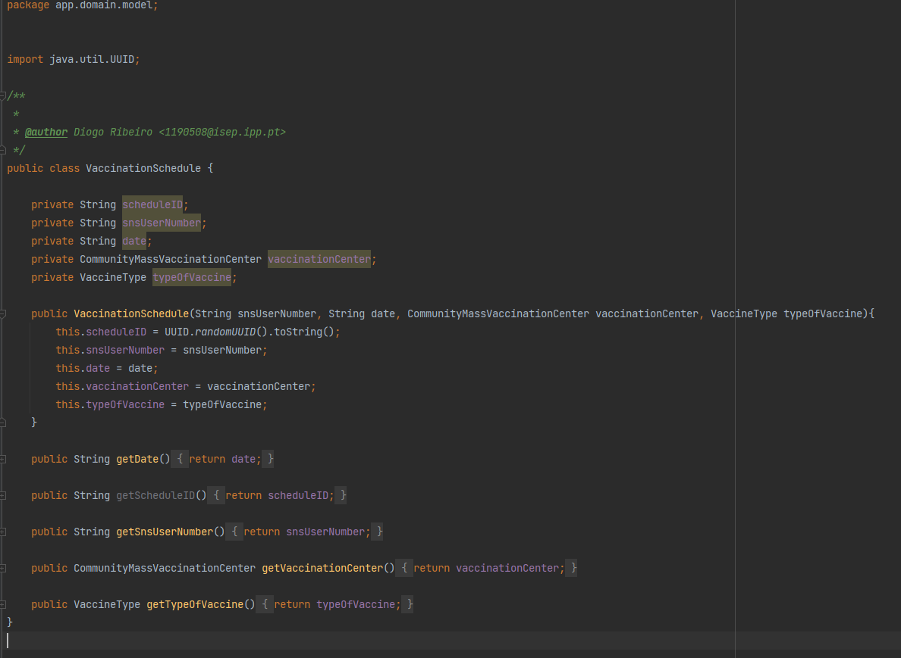

# US 01 - To schedule a vaccine

## 1. Requirements Engineering

### 1.1. User Story Description

As a SNS user, I intend to use the application to schedule a vaccine

### 1.2. Customer Specifications and Clarifications 

**From the specifications document:**

> The application must allow the user schedule a vaccine of a specific type.

**From the client clarifications:**

> **Question:** For the US1, the acceptance criteria is: A SNS user cannot schedule the same vaccine more than once. For the US2, the acceptance criteria is: The algorithm should check if the SNS User is within the age and time since the last vaccine.
[1] Are this acceptance criteria exclusive of each US or are implemented in both?
[2] To make the development of each US more clear, could you clarify the differences between the two US?
>
> **Answer:** 
1 - The acceptance criteria for US1 and US2 should be merged. The acceptance criteria por US1 and US2 is: A SNS user cannot schedule the same vaccine more than once. The algorithm should check if the SNS User is within the age and time since the last vaccine."
2- In US1 the actor is the SNS user, in US2 the actor is the receptionist. In US1 the SNS user is already logged in the system and information that is required and that exists in the system should be automatically obtained. In US2 the receptionist should ask the SNS user for the information needed to schedule a vaccination. Information describing the SNS user should be automatically obtained by introducing the SNS user number.

-

> **Question:** We would like to know if when scheduling a vaccine, should a list of existing vaccine types and vaccination centers be displayed in order for him to choose one option , or should he just enter them?
>
> **Answer:** Please check carefully the project description available in moodle.

### 1.3. Acceptance Criteria

* **AC1:** User must be a SNS User.
* **AC2:** User must be logged in.
* **AC3:** A SNS user cannot schedule the same vaccine more than once.

### 1.4. Found out Dependencies

* **US3:** As a receptionist, I want to register a SNS user.
* **US9:** As an administrator, I want to register a vaccination center to respond to a certain pandemic.
* **US12:** As an administrator, I intend to specify a new vaccine type.

### 1.5 Input and Output Data

**Input Data:**
	
* Selected data:
    * Vaccine Type
    * Vaccination Center

* Typed data:
    * SNS User Number
    * Date

**Output Data:**

* (In)Success of the operation
* Vaccine schedule created

### 1.6. System Sequence Diagram (SSD)

**Other alternatives might exist.**

### 1.7 Other Relevant Remarks

N/A

## 2. OO Analysis

### 2.1. Relevant Domain Model Excerpt 

### 2.2. Other Remarks

N/A

## 3. Design - User Story Realization 

### 3.1. Rationale

| Interaction ID | Question: Which class is responsible for... | Answer                       | Justification (with patterns)                                                                                 |
|:---------------|:--------------------------------------------|:-----------------------------|:--------------------------------------------------------------------------------------------------------------|
| Step 1  		     | 	... interacting with the actor?            | VaccinationScheduleUI        | Pure Fabrication: there is no reason to assign this responsibility to any existing class in the Domain Model. |
| Step 2	  		    | 	... coordinating the US?                   | VaccinationScheduleontroller | Controller                                                                                                    |
| Step 3  		     | 	...retriving all the Vaccine Types?        | VaccinationTypeStore         | IE: has registed all Types                                                                                    |
| Step 4 		      | 	 ...retriving all the Vaccination Centers? | CenterStore                  | IE: has registed all centers                                                                                  |
| Step 5  		     | 	... identifying the types of centers?      | CenterStore                  | Protected Variations: has registered all types of centers and identifies them                                 |
| Step 6  		     | 	... transfering the VaccineType data?      | VaccinationTypeDTO           | Pure Fabrication                                                                                              |
| Step 7  		     | 	... transfering the Center data?           | CenterDTO                    | Pure Fabrication                                                                                              |
| Step 8  		     | 	... presenting the information?            | VaccinationScheduleUI        | Pure Fabrication                                                                                              | 
| Step 9  		     | 	... informing operation success?           | VaccinationScheduleUI        | Pure Fabrication                                                                                              | 

### Systematization ##

According to the taken rationale, the conceptual classes promoted to software classes are: 

 * Company
 * Role
 * Employee

Other software classes (i.e. Pure Fabrication) identified: 

 * EmployeeListUI 
 * EmployeeListController 
 * EmployeeStore
 * AuthFacade

## 3.2. Sequence Diagram (SD)

## 3.3. Class Diagram (CD)

# 4. Tests 

# 5. Construction (Implementation)

## Class EmployeeListController 

## Class Employee

# 6. Integration and Demo 

# 7. Observations

