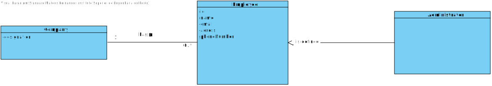
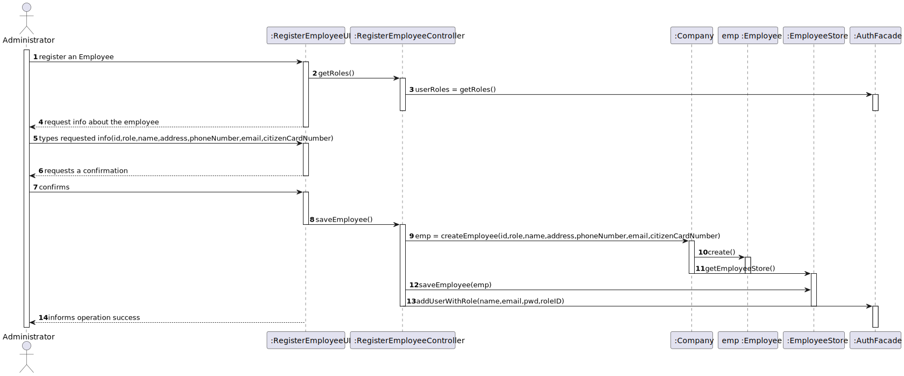

# US 10

## 1. Requirements Engineering

### 1.1. User Story Description

*As an administrator, I want to register an Employee.*

### 1.2. Customer Specifications and Clarifications 

**From the specifications document:**

N/A

**From the client clarifications:**

* Every Employee has only one role (Coordinator, Receptionist, Nurse).
* Employee attributes: Id (automatic), Name, address, phone number, e-mail and Citizen Card number.
* All attributes are mandatory.

### 1.3. Acceptance Criteria

* **AC1:** Each user must have a single role defined in the system. 
* **AC2:** The "auth" component available on the repository must be reused (without modifications).

### 1.4. Found out Dependencies

No dependencies were found

### 1.5 Input and Output Data

**Input Data:**

* Typed data:
    * Name
    * Address
    * Phone Number
    * E-mail
    * Citizen Card Number

* Selected data:
    * Role

**Output Data:**

* (in)success of operation
* list of roles

### 1.6. System Sequence Diagram (SSD)

### 1.7 Other Relevant Remarks

N/A

## 2. OO Analysis

### 2.1. Relevant Domain Model Excerpt 

### 2.2. Other Remarks

N/A

## 3. Design - User Story Realization 

### 3.1. Rationale

**The rationale grounds on the SSD interactions and the identified input/output data.**

| Interaction ID | Question: Which class is responsible for... | Answer  | Justification (with patterns)  |
|:-------------  |:--------------------- |:------------|:---------------------------- |
| Step 1  		 |...registering an Employee?|Company|Creator|
| Step 2  		 |...requesting info about the employee?|n/a||
| Step 3  		 |...typing requested info?|Employee|IE: The object created in step 1 has its own data.|
| Step 4  		 |...requesting a confirmation?|RegisterEmployeeUI|IE: responsible for user interaction |
| Step 5  		 |...confirming?|Company|IE: saves all the Employee objects |
| Step 6  		 |...informing operation success|RegisterEmployeeUI|IE: responsible for user interaction|              

### Systematization ##

According to the taken rationale, the conceptual classes promoted to software classes are: 

 * Company
 * Employee

Other software classes (i.e. Pure Fabrication) identified: 
 * RegisterEmployeeUI  
 * RegisterEmployeeController
 * EmployeeStore

## 3.2. Sequence Diagram (SD)

## 3.3. Class Diagram (CD)

# 4. Tests

# 5. Construction (Implementation)

# 6. Integration and Demo

# 7. Observations

