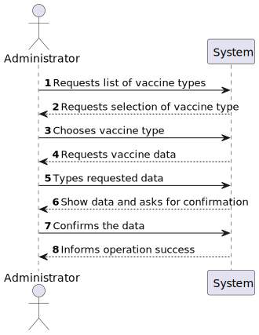
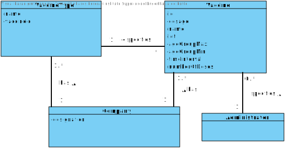
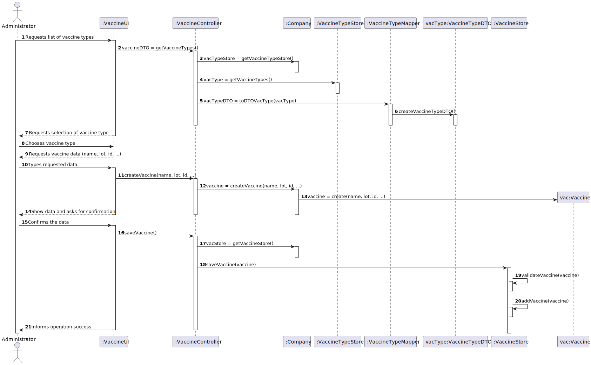
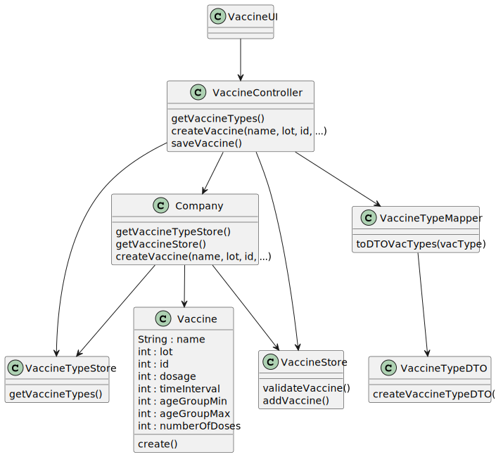

# US13

## 1. Requirements Engineering

### 1.1. User Story Description

As an administrator, I intend to specify a new vaccine and its administration process.

### 1.2. Customer Specifications and Clarifications 

**From the specifications document:**
> The vaccine
administration process comprises (i) one or more age groups (e.g.: 5 to 12 years old, 13 to 18 years
old, greater than 18 years old), and (ii) per age group, the doses to be administered (e.g.: 1, 2, 3), the
vaccine dosage (e.g.: 30 ml), and the time interval regarding the previously administered dose.

**From the client clarifications:**

> **Question:** We would like to know if when specifying a new Vaccine and its Administration Process, should a list of the existing types of vaccines be displayed in order for him to choose one, or should he just input it?
>  
> **Answer:**  If the information is available in the system, it is a good practice to present the information to the user and ask the user to select;

### 1.3. Acceptance Criteria

* **AC1:** All required fields must be filled in.
* **AC2:** User must be logged in as administrator.
* **AC3:** There must be at least one vaccine type created.

### 1.4. Found out Dependencies

* There is a dependency to "US012 - As an administrator, I intend to specify a new vaccine type" since at least a vaccine type must exist to create a vaccine of.

### 1.5 Input and Output Data

**Input Data:**

* Typed data:
    * Name
    * Lot
    * Id
    * Dosage
    * Age Group Max
    * Age Group Min
    * Time interval
    * Number of doses

* Selected Data:
    * Vaccine Type

**Output Data:**

* (In)Success of the operation
* List of Vaccine types

### 1.6. System Sequence Diagram (SSD)

**Alternative 1**

**Other alternatives might exist.**

### 1.7 Other Relevant Remarks

N/A

## 2. OO Analysis

### 2.1. Relevant Domain Model Excerpt 

### 2.2. Other Remarks

N/A

## 3. Design - User Story Realization 

### 3.1. Rationale

**SSD - Alternative 1 is adopted.**

| Interaction ID | Question: Which class is responsible for... | Answer  | Justification (with patterns)  |
|:-------------  |:--------------------- |:------------|:---------------------------- |
| Step 1  		 |	... requesting list of vaccine types? | VaccineController   |  Pure Fabrication: there is no reason to assign this responsibility to any existing class in the Domain Model.           |	
|                |  ...coordinating the US? | VaccineController | Controller
| Step 2  		 |	...requesting data?	 | N/A            |                              |
| Step 3  		 
| Step 4  		 | ...requesting vaccine data? | N/A |  |
| Step 5  		 | ...typing requested data? | Vaccine | IE: The object Vaccine has its own data  |
| Step 6  		 | ...showing data and asking for confirmation? | VaccineUI | IE: responsible for user interaction |
| Step 7  		 |	... confirming? | VaccineStore  | IE: saves all the Vaccine objects.  |
| Step 8  		 |	...informing operation success? | VaccineUI | IE: responsible for user interaction. |

### Systematization ##

According to the taken rationale, the conceptual classes promoted to software classes are: 

 * Company
 * Vaccine
 * Vaccine Type

Other software classes (i.e. Pure Fabrication) identified: 

 * VaccineUI 
 * VaccineController
 * VaccineTypeStore

## 3.2. Sequence Diagram (SD)

## 3.3. Class Diagram (CD)

# 4. Tests

# 5. Construction (Implementation)

# 6. Integration and Demo

# 7. Observations

