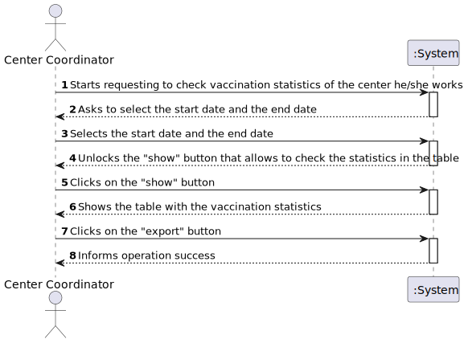
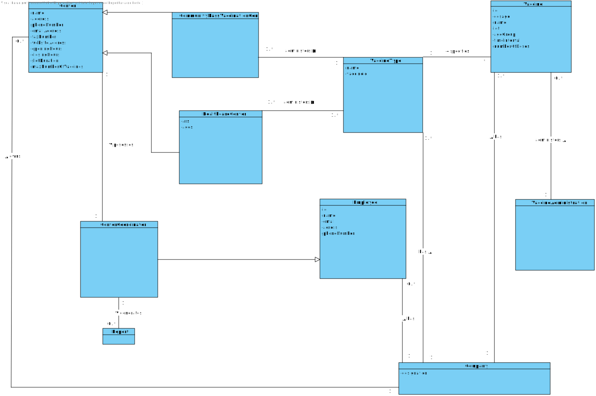
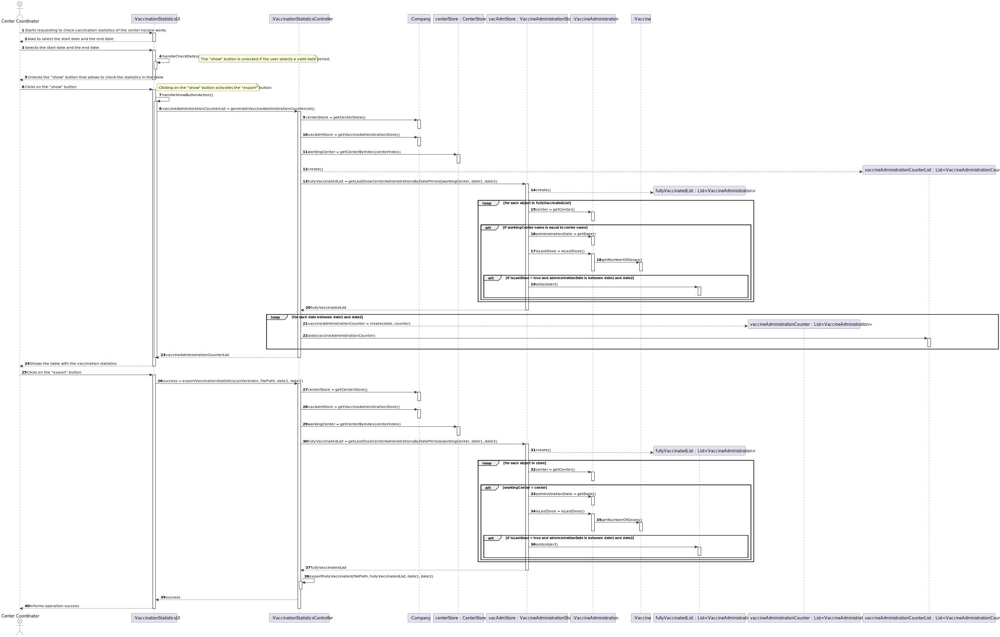
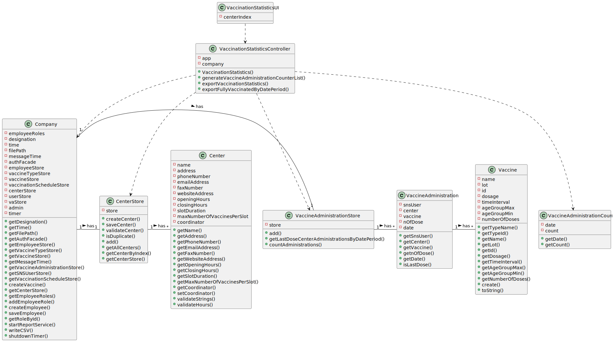

# US 15 - To check and export vaccination statistics

## 1. Requirements Engineering

### 1.1. User Story Description

As a center coordinator, I intend to check and export vaccination statistics. I want to export, to a csv file, the total number of fully vaccinated users per day.

### 1.2. Customer Specifications and Clarifications

**From the specifications document:**

n/a

**From the client clarifications:**

> **Question:** When exporting vaccination statistics,do we export the data from all days available in the system or does the center coordinator chooses the time interval?
>
> **Answer:** The user should define a time interval (two dates).

-

> **Question:** Is there any kind of format our exported data should follow?
>
> **Answer:** Data format: date; number of fully vaccinated user.

-

> **Question:** Is the exportation of the CSV file that contains the total number of fully vaccinated users per day, the only feature that needs to be implemented in code, for US15?
>
> **Answer:** Yes.

-

> **Question:** Should the user introduce the name of the file intended to export the vaccination statistics ?
>
> **Answer:** The user should introduce the name of the file.

-

> **Question:** Are the vaccination statistics refering only to the fully vaccinated users or refering to something more ?
>
> **Answer:** Only to fully vaccinated users.

-

> **Question:** In this US should the Center Coordinator check and export the Vaccination Statistics of the Center where he/she works at or should just check and export the Vaccination Statistics of all centers?
>
> **Answer:** The center coordinator can only export statistics from the vaccination center that he coordinates.

-

> **Question:** I want to know what you mean about fully vaccinated, it is a person who have take all the doses that are defined for a specific vaccine??
>
> **Answer:** I already answered this question, please pay more attention to client answers. Again, a SNS user is fully vaccinated when he receives all doses of a given vaccine. A SNS user that has received a single-dose vaccine is considered fully vaccinated and will not take more doses.

-

> **Question:** In a previous answer you said "Data format: date; number of fully vaccinated user.". So our question is: -> Should we group all sns users fully vaccinated per day of different vaccine types into a total number of that day? Or should we divide the number by vaccine types?
>
> **Answer:** The output data should be the date and the number of fully vaccinated users.

-

> **Question:** Which "vaccination statistics" are you referring to?
>
> **Answer:** The application should be used to check the total number of fully vaccinated users per day in the vaccination center that the center coordinator coordinates. Please draw appropriate charts.

-

> **Question:** On this US we only have to do a funcionality that creates a csv file with the vaccination statistcs right?
>
> **Answer:** I already answered this question. The center coordinator wants to check the statistics in the application and should be able to export to a CSV file.

-

> **Question:** Do you want us to show the full vaccinated users in each individual day, or should we show the continuous sum of fully vaccinated users?
>
> **Answer:** In a previous answer, the client specified the format of the data: "day, number of fully vaccinated". The client wants the total of fully vaccinated users per day.

### 1.3. Acceptance Criteria

n/a

### 1.4. Found out Dependencies

* There is a dependency to "US8 Record the administration of a vaccine to a SNS user" since at least a center must exist to obtain it's waiting list.

### 1.5 Input and Output Data

**Input Data:**

* Start date
* End date
* Path
* File name

**Output Data:**

* (In)Success of the operation

### 1.6. System Sequence Diagram (SSD)

**Alternative 1**

### 1.7 Other Relevant Remarks

n/a

## 2. OO Analysis

### 2.1. Relevant Domain Model Excerpt

### 2.2. Other Remarks

n/a

## 3. Design - User Story Realization

### 3.1. Rationale

| Interaction ID | Question: Which class is responsible for... | Answer                                | Justification (with patterns)                                                                                 |
|:---------------|:--------------------------------------------|:--------------------------------------|:--------------------------------------------------------------------------------------------------------------|
| Step 1         | ... interacting with the actor?             | VaccinationStatisticsUI         | Pure Fabrication: there is no reason to assign this responsibility to any existing class in the Domain Model. |
| Step 2         | ... Asking the start date and the end date to the user?                                            |    VaccinationStatisticsUI                                   |  Information Expert: it is responsible for user interactions.                                                                                                             |
| Step 3         |                                            |                                       |                                                                                                               |
| Step 4         | ... Making the "show" button visible?                                            | VaccinationStatisticsUI                                      |    Information Expert: it is responsible for user interactions.                                                                                                             |
| Step 5         | ... coordinating the US?                    | VaccinationStatisticsController | Controller                                                                                                     |
|       | ... controlling the flow of the user scenario?                    | VaccinationStatisticsController | Controller: ensures that one step is not executed before the other.                                                                                                    |
|       | 	... serving as an intermediary between the ui layer and the domain layer?                    | VaccinationStatisticsController | Controller: direct communication between UI classes and domain classes must be avoided.                                                                                                    |
|       | 	... storing the centers?                | CenterStore | Pure Fabrication: in order to promote reuse and to attend High Cohesion and Low Coupling patterns, the CenterStore exists to be responsible for saving and returning the centers.                                                                                                    |
|       | 	... returning the center store?                | Company | Information Expert: owns the center store.                                                                                                  |
|       | 	... storing the vaccine administrations?                | VaccineAdministrationStore | Pure Fabrication: in order to promote reuse and to attend High Cohesion and Low Coupling patterns, the VaccineAdministrationStore exists to be responsible for saving and returning the vaccine administrations.                                                                                                  |
|       | 	... returning the administration store?                | Company | Information Expert: owns the administration store.                                                                                                  |
|       | 	... returning the center where the center coordinator is working at?                | CenterStore | Information Expert: knows its own centers.                                                                                                  |
|       | 	... creating the list of VaccineAdministrationCounters?                | VaccinationStatisticsController | Creator (Rule 3): Controller closely uses the vaccineAdministrationCounterList.                                                                                               |
|       | 	... creating the list that will return all last dose vaccine administrations of a specific center with a specific date period?                | VaccineAdministrationStore | Creator (Rule 3): Controller closely uses the fullyVaccinatedList                                                                                              |
|       | 	... checking the center, the administration date and check if a specific vaccine administration corresponds to the last dose of the associated vaccine?                | VaccineAdministrationStore | Information Expert: knows its own vaccine administrations.                                                                                                  |
|       | 	... knowing the necessary data for a specific vaccine administration?                | VaccineAdministration | Information Expert: knows its own data.                                                                                                  |
|       | 	... knowing the number of doses of the vaccine?                | Vaccine | Information Expert: knows its own data.                                                                                                  |
| Step 6      | 	... returning the list of all last dose vaccine administrations on a specific center with a specific date period?                | VaccineAdministrationStore | Information Expert: knows its own vaccine administrations.                                                                                                  |
|       | 	... creating the list that is responsible to save each vaccine administration counter?                | VaccinationStatisticsController | Creator (Rules 3 and 4): controller closely uses the list and  has the data to initialize it.                                                                                                 |
|       | 	... showing the table with the vaccination statistics?                | VaccinationStatisticsUI | Information Expert: is responsible for user interactions.                                                                                                  |
| Step 7      | 	... storing the centers?                | CenterStore | Pure Fabrication: in order to promote reuse and to attend High Cohesion and Low Coupling patterns, the CenterStore exists to be responsible for saving and returning the centers.                                                                                                    |
|       | 	... returning the center store?                | Company | Information Expert: owns the center store.                                                                                                  |
|       | 	... storing the vaccine administrations?                | VaccineAdministrationStore | Pure Fabrication: in order to promote reuse and to attend High Cohesion and Low Coupling patterns, the VaccineAdministrationStore exists to be responsible for saving and returning the vaccine administrations.                                                                                                  |
|       | 	... returning the administration store?                | Company | Information Expert: owns the administration store.                                                                                                  |
|       | 	... returning the center where the center coordinator is working at?                | CenterStore | Information Expert: knows its own centers.                                                                                                  |
|       | 	... creating the list that will return all last dose vaccine administrations of a specific center with a specific date period?                | VaccineAdministrationStore | Creator (Rule 3): Controller closely uses the fullyVaccinatedList                                                                                              |
|       | 	... checking the center, the administration date and check if a specific vaccine administration corresponds to the last dose of the associated vaccine?                | VaccineAdministrationStore | Information Expert: knows its own vaccine administrations.                                                                                                  |
|       | 	... knowing the necessary data for a specific vaccine administration?                | VaccineAdministration | Information Expert: knows its own data.                                                                                                  |
|       | 	... knowing the number of doses of the vaccine?                | Vaccine | Information Expert: knows its own data.                                                                                                  |
| Step 8      | 	... returning the list of all last dose vaccine administrations on a specific center with a specific date period?                | VaccineAdministrationStore | Information Expert: knows its own vaccine administrations.                                                                                                  |
|       | 	... showing the success of the operation?                | VaccinationStatisticsUI | Information Expert: is responsible for user interactions.                                                                                                  |

### Systematization ##

According to the taken rationale, the conceptual classes promoted to software classes are:

* Company
* VaccineAdministration
* Vaccine

Other software classes (i.e. Pure Fabrication) identified:

* VaccinationStatisticsUI
* VaccinationStatisticsController
* CenterStore
* VaccineAdministrationStore

## 3.2. Sequence Diagram (SD)

## 3.3. Class Diagram (CD)

# 4. Tests

# 5. Construction (Implementation)

## Class CreateTaskController

		public {
		}

## Class Organization

		public {
		}

# 6. Integration and Demo

n/a

# 7. Observations

n/a