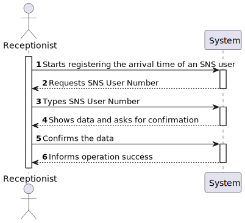
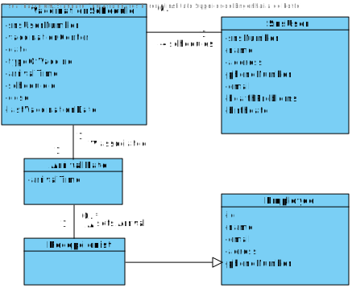
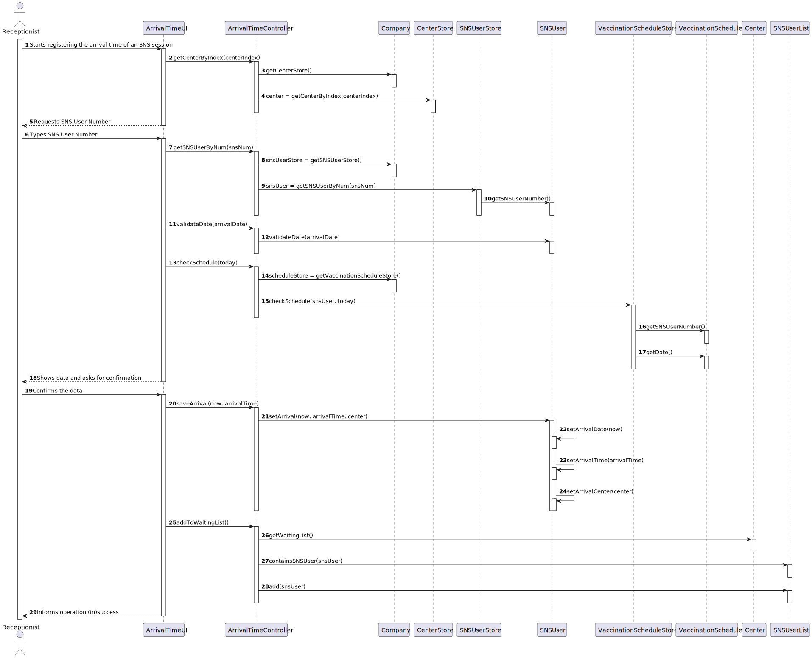
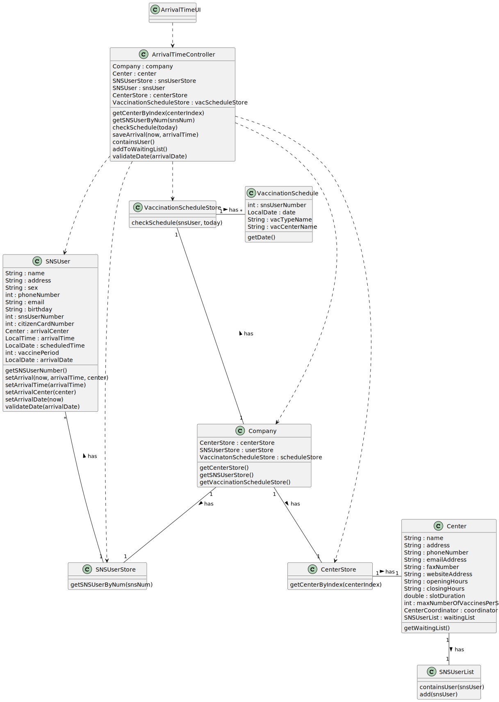

# US 04 - Register arrival time of SNS User

## 1. Requirements Engineering

### 1.1. User Story Description

As a receptionist at a vaccination center, I want to register the arrival of a SNS user
to take the vaccine.

### 1.2. Customer Specifications and Clarifications 

**From the specifications document:**

>	When the SNS user arrives at the vaccination center, a receptionist registers the arrival of the user to take the respective vaccine. The receptionist asks the SNS user for his/her SNS user number and confirms that he/she has the vaccine scheduled for the that day and time. If the information is correct, the receptionist acknowledges the system that the user is ready to take the vaccine. Then, the receptionist should send the SNS user to a waiting room where (s)he should wait for his/her time.

**From the client clarifications:**
> **Question:**  "Regarding US04, the attribute "arrival time" should be considered to let the user enter the waiting room.
For example, a user that arrives 40 minutes after his appointment wont be allowed to enter the center, and another who only arrives 10 minutes late may proceed. If so, how much compensation time should we provide to the user."
>
>  
> **Answer:**  "In this sprint we are not going to address the problem of delays. All arriving users are attended and registered by the receptionist."

-

> **Question:** "In this user story, the receptionist registers the arrival of an SNS User. Does the receptionist choose the center she works at during login like the nurse?"
>  
> **Answer:** "To start using the application, the receptionist should first select the vaccination center where she is working. The receptionists register the arrival of a SNS user at the vaccination center where she is working."

-

> **Question:** "Regarding US04, what are the attributes needed in order to register the arrival of a SNS user to a vaccination center". 
> 
> **Answer:** "The time of arrival should be registered."

-

> **Question:** "Regarding US04, I would like to know what's the capacity of the waiting room."
>
> **Answer:** "The waiting room will not be registered or defined in the system. The waiting room of each vaccination center has the capacity to receive all users who take the vaccine on given slot."

-

> **Question:** "When the SNS user number is introduce by the receptionist and the system has no appointment for that SNS user number, how should the system proceed?"
> 
> **Answer:** "The application should present a message saying that the SNS user did not scheduled a vaccination."
### 1.3. Acceptance Criteria

* **AC1:** No duplicate entries should be possible for the same SNS user on the same day or vaccine period.
* **AC2:** There must be at least on center registered.
* **AC3:** The SNS User must have a schedule that coincides with the arrival date.

### 1.4. Found out Dependencies

* There is a dependency to "US01 - As a SNS user, I intend to use the application to schedule a vaccine." since the system must verify if the SNS User has a scheduled appointment for the date of arrival.
* There is a dependency to "US09 - As an administrator, I want to register a vaccination center to respond to a certain pandemic" since there must be at least one center registered in the system.

### 1.5 Input and Output Data

**Input Data:**

* Typed data:
   * SNS User Number
   

**Output Data:**

* Confirmation of data inputs
* (In)Success of the operation

### 1.6. System Sequence Diagram (SSD)

## 2. OO Analysis

### 2.1. Relevant Domain Model Excerpt

## 3. Design - User Story Realization 

### 3.1. Rationale

| Interaction ID | Question: Which class is responsible for... | Answer  | Justification (with patterns)  |
|:-------------  |:--------------------- |:------------|:---------------------------- |
| Step 1  		 |	...interacting with the actor? | ArrivalTimeUI   |  Pure Fabrication: there is no reason to assign this responsibility to any existing class in the Domain Model.           |
| 			     |	...coordinating the US? | ArrivalTimeController | Controller                             |
| 			  	 |	...serving as an intermediary between the UI layer and the Domain layer?   | Controller | Controller: direct communication between UI classes and domain classes must be avoided. |
|                |  ...storing the centers? | CenterStore | Pure Fabrication: in order to promote reuse and to attend High Cohesion and Low Coupling patterns, the CenterStore exists to be responsible for saving and returning the centers. |
|                |  ...returning the center store? | Company | Information Expert: owns/knows all stores |
|                |  ...returning the receptionist's center? | CenterStore | Information Expert: owns/knows all centers |
| Step 2         |  ...requesting SNSNumber to the receptionist? | ArrivalTimeUI | UI: responsible for user interaction |
| Step 3         |  ...typing SNS User Number? | Receptionist | |
|                |  ...storing the SNS Users? | SNSUserStore | Pure Fabrication: in order to promote reuse and to attend High Cohesion and Low Coupling patterns, the CenterStore exists to be responsible for saving and returning the centers. |
|                |  ...returning the SNS User store? | Company | Information Expert: owns/knows all stores
|                |  ...returning the SNS User? | SNSUserStore | Information Expert: owns/knows all sns users
|                |  ...storing the vaccination schedules? | VaccinationScheduleStore | Pure Fabrication: in order to promote reuse and to attend High Cohesion and Low Coupling patterns, the CenterStore exists to be responsible for saving and returning the centers. |
|                |  ...returning the vaccination schedule store? | Company | Information Expert: owns/knows all stores
|                |  ...verifying the schedule for the SNS User? | VaccinationScheduleStore | Information Expert: owns/knows all vaccination schedules |
| Step 4         |  ...showing and asking for confirmation of the input data? | ArrivalTimeUI | |
| Step 5         |  ...confirming the data? | Receptionist |  |
|                |  ...validating the data? | SNSUser | Information Expert: owns/knows its own data. |
|                |  ...saving the data? | SNSUser | Information Expert: owns/knows its own data. |
|                |  ...returning the waiting list of a center? | Center | Information Expert: owns/knows its own waiting list. |
|                |  ...adding user to waiting list? | SNSUserList | Information Expert: owns/knows its own data.
| Step 6         |  ...informing operation (in)success | ArrivalTimeUI | UI: responsible for user interaction

### Systematization ##

According to the taken rationale, the conceptual classes promoted to software classes are: 

 * Company
 * SNSUser
 * VaccinationSchedule
 * Center

Other software classes (i.e. Pure Fabrication) identified: 

 * ArrivalTimeUI
 * ArrivalTimeController
 * CenterStore
 * SNSUserStore
 * VaccinationScheduleStore
 * SNSUserList

## 3.2. Sequence Diagram (SD)

## 3.3. Class Diagram (CD)

# 4. Tests 

# 5. Construction (Implementation)

# 6. Integration and Demo 

# 7. Observations

