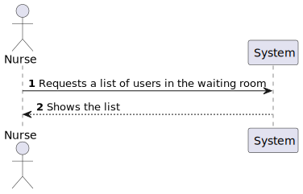
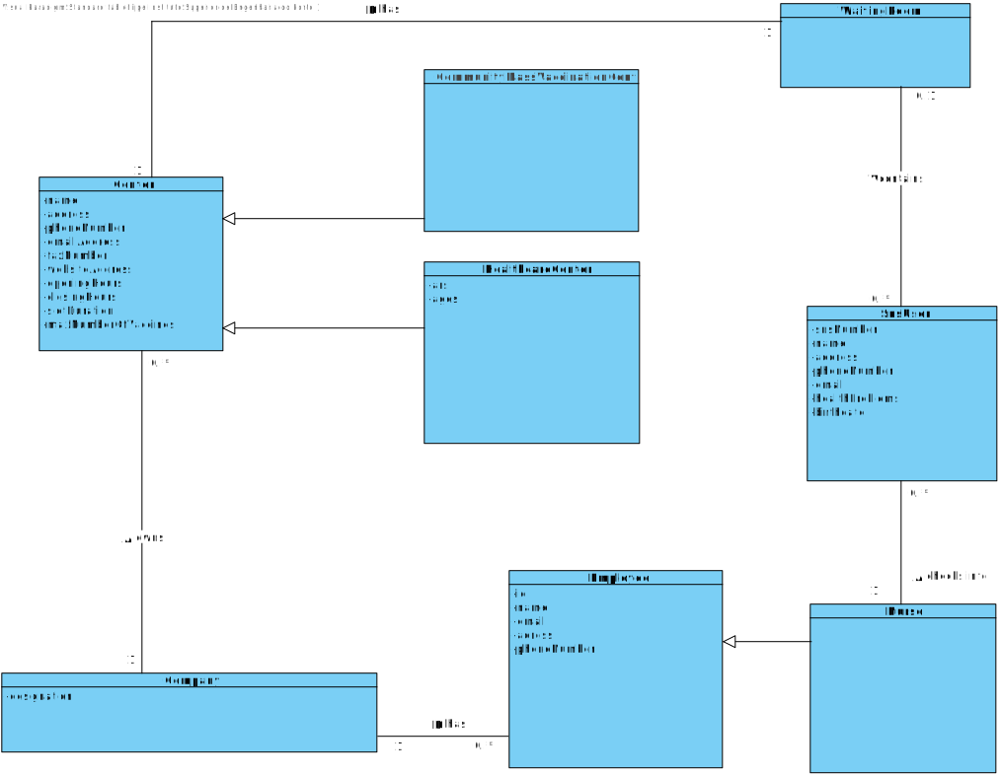
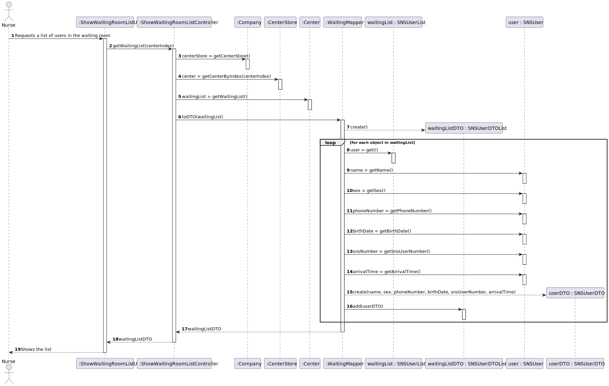
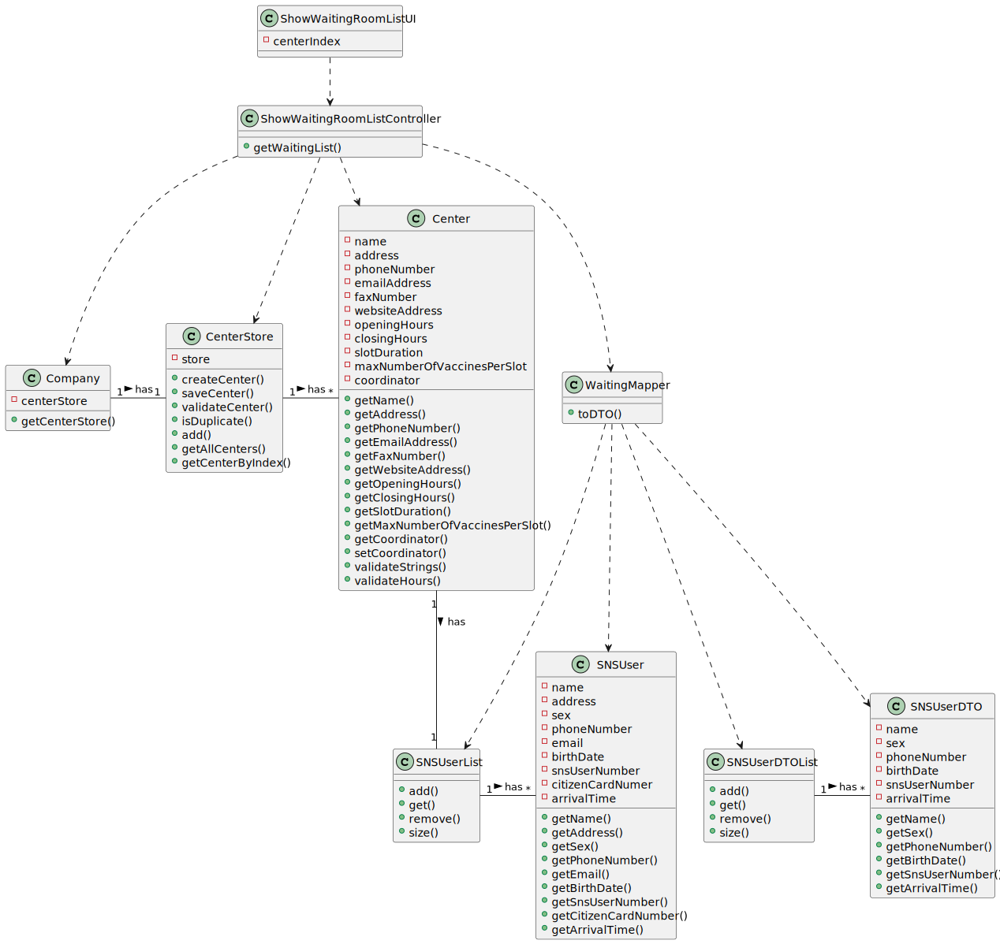

# US 5 - To consult the users in the waiting room of a vaccination center

## 1. Requirements Engineering

### 1.1. User Story Description

As a nurse, I intend to consult the users in the waiting room of a vacination center.

### 1.2. Customer Specifications and Clarifications

**From the specifications document:**

n/a

**From the client clarifications:**

> **Question:** We need to know if the nurse have to chose the vaccination center before executing the list or if that information comes from employee file?
>
> **Answer:** When the nurse starts to use the application, firstly, the nurse should select the vaccination center where she his working. The nurse wants to check the list of SNS users that are waiting in the vaccination center where she his working.

-

> **Question:** We need to know what is the name of the attribute that defines that the user has arrived. In the last sprint we have created the “Status” attribute, can we continue using it?
>
> **Answer:** This is not a question for the client.

-

> **Question:** Regarding US 05, what does consulting constitute in this context? Does it refer only to seeing who is present and deciding who gets the vaccine or is checking the user info to administer the vaccine, registering the process, and sending it to the recovery room also part of this US?
>
> **Answer:** The goal is to check the list of users that are waiting and ready to take the vaccine.

-

> **Question:** Regarding the US05. In the PI description it is said that, by now, the nurses and the receptionists will work at any center. Will this information remain the same on this Sprint, or will they work at a specific center?
>
> **Answer:** Nurses and receptionists can work in any vaccination center.

-

> **Question:** Regarding US05, the listing is supposed to be for the day itself or for a specific day.
>
> **Answer:** The list should show the users in the waiting room of a vaccination center.

-

> **Question:** What information about the Users (name, SNS number, etc) should the system display when listing them?
>
> **Answer:** Name, Sex, Birth Date, SNS User Number and Phone Number.

-

> **Question:** Is it supposed to remove a SNS user of the wait list when he leaves the waiting room to get the vaccine? If yes, how do we know when the sns user leaves the waiting room?
>
> **Answer:** US5 is only to list users that are in the waiting room of a vaccination center. In Sprint D we will introduce new user stories.

### 1.3. Acceptance Criteria

* **AC1:** SNS Users’ list should be presented by order of arrival.

### 1.4. Found out Dependencies

* There is a dependency to "US9 Register a vaccination center" since at least a center must exist to obtain it's waiting list.

### 1.5 Input and Output Data

**Input Data:**

n/a

**Output Data:**

* List of waiting users
* (In)Success of the operation

### 1.6. System Sequence Diagram (SSD)

**Alternative 1**

### 1.7 Other Relevant Remarks

n/a

## 2. OO Analysis

### 2.1. Relevant Domain Model Excerpt

### 2.2. Other Remarks

n/a

## 3. Design - User Story Realization

### 3.1. Rationale

| Interaction ID | Question: Which class is responsible for...                                | Answer                                           | Justification (with patterns)                                                                                                                                                            |
|:---------------|:---------------------------------------------------------------------------|:-------------------------------------------------|:-----------------------------------------------------------------------------------------------------------------------------------------------------------------------------------------|
| Step 1  		     | 	... interacting with the actor?                                           | ShowWaitingRoomListUI                            | Pure Fabrication: there is no reason to assign this responsibility to any existing class in the Domain Model.                                                                            |
| 			  		        | 	... coordinating the US?                                                  | ShowWaitingRoomListController                    | Controller                                                                                                                                                                               | | | |
| 			  		        | 	... controlling the flow of the user scenario?                            | ShowWaitingRoomListController                    | Controller: ensures that one step is not executed before the other.                                                                                                                      | | | |
| 			  		        | 	... serving as an intermediary between the UI layer and the Domain layer? | ShowWaitingRoomListController                    | Controller: direct communication between UI classes and domain classes must be avoided.                                                                                                  | | | |
| 		             | 	... storing the centers?                                                  | CenterStore                                      | Pure Fabrication: in order to promote reuse and to attend High Cohesion and Low Coupling patterns, the CenterStore exists to be responsible for saving and returning the centers.        |
| 		             | 	... returning the center store?                                           | Company                                          | Information Expert: owns the center store.                                                                                                                                               |
| 		             | 	... returning the nurse's center?                                         | CenterStore                                      | Information Expert: knows/owns its centers.                                                                                                                                              |                                                                                                                                                          |
| 		             | 	... returning the waiting list?                                           | Center                                           | Information Expert: owns its own waiting list.                                                                                                                                           |
| 			  		        | 	... instantiating a new DTO that represents a waiting list?               | WaitingMapper                                    | Creator (Rule 4): WaitingMapper has the data to initialize SNSUserDTOList.                                                                                                               |
| 			  		        | 	... knowing the SNS users that are in the waiting room?                   | SNSUserList                                      | Pure Fabrication: in order to promote reuse and to attend High Cohesion and Low Coupling patterns, the collection of users that are waiting in the waiting room was promoted to a class. |
| 			  		        | 	... knowing each SNS user in the waiting list?                            | SNSUserList                                      | Information Expert: knows/has its own SNS users.                                                                                                                                         |
| 			  		        | 	... knowing the necessary data for a specific user?                       | SNSUser                                          | Information Expert: knows its own data.                                                                                                                                                  |
| 			  		        | 	... instantiating a new DTO that represents a SNS user?                   | WaitingMapper                                    | Creator (Rule 4): WaitingMapper has the data to initialize SNSUserDTO.                                                                                                                   |
| 			  		        | 	... saving each DTO that represents a specific SNS user?                  | SNSUserDTOList                                   | Information Expert: owns its own data.                                                                                                                                                   |
| Step 2			  		        | 	... returning the dto list to the controller?                             | WaitingMapper                                    | Information Expert: owns the generated list.                                                                                                                                             |
|   		     | 	... showing the list?                                         |  ShowWaitingRoomListUI                           | Information Expert: is responsible for user interactions                                                                                                                                 |

### Systematization ##

According to the taken rationale, the conceptual classes promoted to software classes are:

* SNSUser

Other software classes (i.e. Pure Fabrication) identified:

* ShowWaitingRoomListUI
* ShowWaitingRoomListController
* WaitingMapper
* SNSUserList
* SNSUserDTOList

## 3.2. Sequence Diagram (SD)

## 3.3. Class Diagram (CD)

# 4. Tests

# 5. Construction (Implementation)

## Class CreateTaskController

		public {
		}

## Class Organization

		public {
		}

# 6. Integration and Demo

n/a

# 7. Observations

n/a