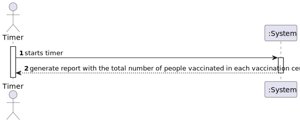
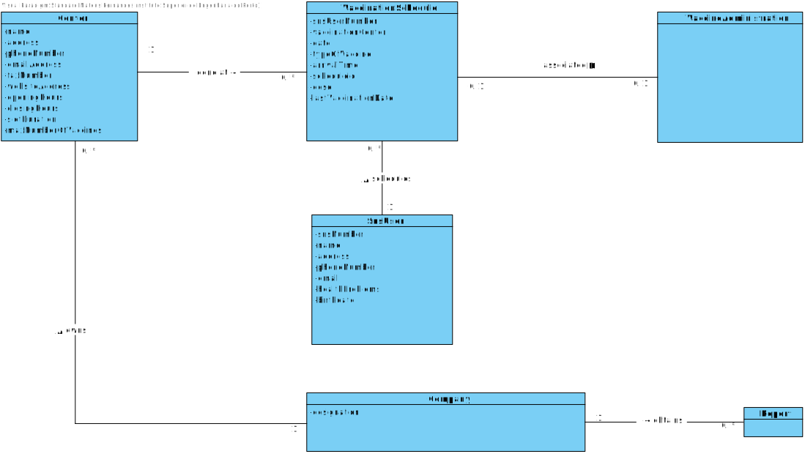
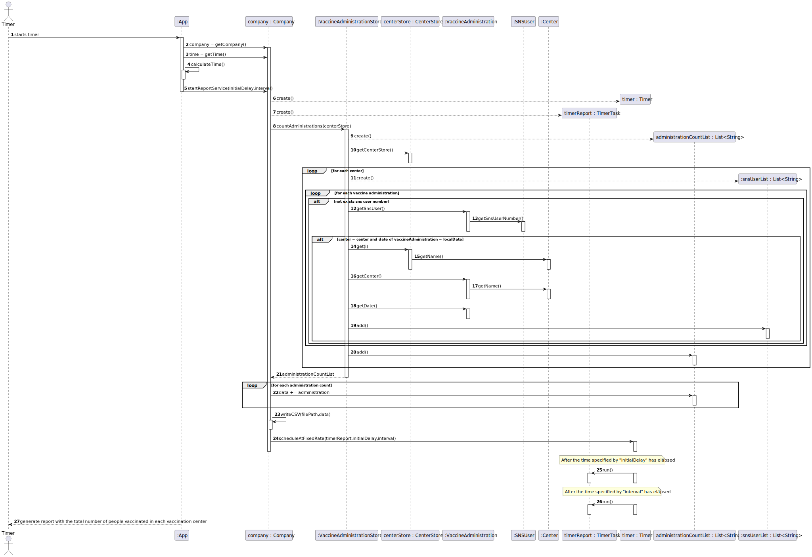
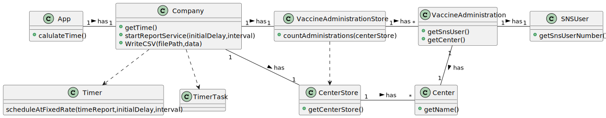

# US 06

## 1. Requirements Engineering

### 1.1. User Story Description

*DGS wants to record daily the total number of people vaccinated in each vaccination center*

### 1.2. Customer Specifications and Clarifications 

**From the specifications document:**

N/A

**From the client clarifications:**

* Q: In the acceptance criteria, "the algorithm should run automatically at a time defined in a configuration file and should register a date, the name of the vaccination center and the total number of vaccinated users." How it is supposed to register this information? Should it be recorded in a file (ex: txt,..) or recorded in the system (ex: in a store) ?
* A: The data should be written to a CSV file (field delimiter should be a semicolon).

* Q: We would like to know which kind of user (Administrator, Nurse...) is supposed to have access to the file generated by the system.
* A: Someone from DGS.

* Q: Regarding US06, who is allowed to change or make the change in the Configuration file?
* A: US6 does not change the Configuration file. This file is created externally to the application and US6 makes use of the information it has.
  You can for example consider, in terms of modeling, that at the moment the Company is created, it receives the information (for example, the time at which the algorithm should be run) that is in the Configuration file. From that moment on, the Company gets that information.

* Q: The filePath of the CSV file where the necessary information will be stored will be asked to the user on ui or will it be default? 
  Will statistics only be stored in the file or will they have to be displayed on the ui?
* A: The US6 is not supposed to have UI. It runs automatically at a preset time, so you don’t need UI.
  The path can be set in the configuration file, or else the CSV file can be stored in a default location.
  Statistics should only be stored on file.

* Q: Should the Company choose first the vaccination center that wants to analyze or should the program show the information of all the vaccination centers?
* A: The application should show the information for all vaccination centers.

* Q: After asking you to be more clear with your answer to my previous questions, you said that we can either access directly the "vaccinations report" file or create the option for center coordinators and administrators to view it's content, is this correct?
* A: You misunderstood, I didn't say that. The file should be available in the file system and anyone having access to the file system can read the file contents.

* Q: I'd like to clarify something, should we implement some sort of message for when the file is saved or warning if there were any errors saving the file using JavaFX or use JavaFX in any other away in US06?
* A: No. The user story runs automatically without user interaction.

* Q: Does the report contain the count of vaccinations of the current day (which depending on the time of day can be incomplete) or the day before?
* A: Should record vaccinations of the current day.

### 1.3. Acceptance Criteria

* **AC1:** The application should run automatically
* **AC2:** The time must be defined in the configuration file
* **AC3:** The application should register the date, the name of the vaccination center and the total number of vaccinated users

### 1.4. Found out Dependencies

*There is a dependency to "US8 record the administration of a vaccine to a SNS user" because the application needs to check the vaccine administrations in order to generate the necessary export file*

### 1.5 Input and Output Data

**Input Data:**

* N/A

**Output Data:**
	
* N/A

### 1.6. System Sequence Diagram (SSD)

### 1.7 Other Relevant Remarks

* The filePath of the CSV file must be also defined in the configuration file.

## 2. OO Analysis

### 2.1. Relevant Domain Model Excerpt 

### 2.2. Other Remarks

N/A

## 3. Design - User Story Realization 

### 3.1. Rationale

| Interaction ID | Question: Which class is responsible for... | Answer  | Justification (with patterns)  |
|:-------------  |:--------------------- |:------------|:---------------------------- |
| Step 1  		 |...starting the timer? |n/a||
|   		       |...returning the time?|Company|IE: has a time, defined in a configuration file|
| 		   |...calculating the time? |App|IE: App has now the info necessary for this operation |
|   		       |...owning the VaccineAdministrationStore and CenterStore|Company|IE: owns the stores|
|              |...owning the vaccine administrations?|VaccineAdministrationStore|PureFabrication: in order to promote reuse and to attend High Cohesion and Low Coupling patterns, the VaccineAdministrationStore exists to be responsible for saving and returning the vaccine administrations.|
|              |...owning the centers?|CenterStore|PureFabrication: in order to promote reuse and to attend High Cohesion and Low Coupling patterns, the CenterStore exists to be responsible for saving and returning the centers.|
|              |...counting the vaccine administrations?|VaccineAdministrationStore|IE: responsible for counting the administrations because they are saved in the store|
| 		   |...creating the list with the administrations? |VaccineAdministrationStore|Creator: Creates the list with the required information to write in the csv |  
| 		   |...returning the info of a vaccine administration? |VaccineAdministration|IE: SNSUser has the info required for this operation |
| 		   |...returning the info of a sns user? |SNSUser|IE: SNSUser has the info required for this operation |
| 		   |...returning the info of a center? |Center|IE: Center has the info required for this operation |
|  		         |...writing the data required in the CSV file?|Company|IE: Company has the information to write in the CSV line by line|
| 		   |...scheduling the task? |Company|IE: Company has the timer and the task|  
| Step 2		   |...generating report with the total number of people vaccinated in each vaccination center? |App|IE: App has the information required to generate the report |              

### Systematization ##

According to the taken rationale, the conceptual classes promoted to software classes are: 

 * Company
 * VaccineAdministration
 * SNSUser
 * Center

Other software classes (i.e. Pure Fabrication) identified: 
 
 * App
 * VaccineAdministrationStore
 * CenterStore

## 3.2. Sequence Diagram (SD) 

## 3.3. Class Diagram (CD)

# 4. Tests 

# 5. Construction (Implementation)

# 6. Integration and Demo 

# 7. Observations

