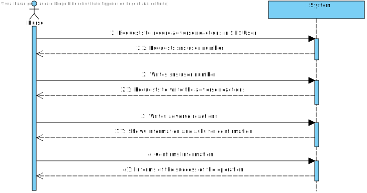
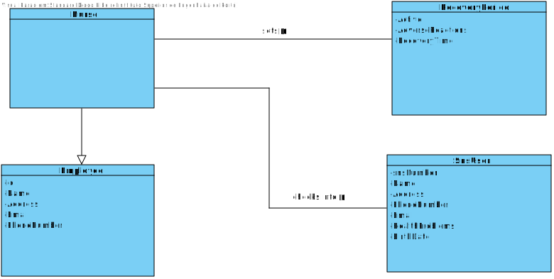
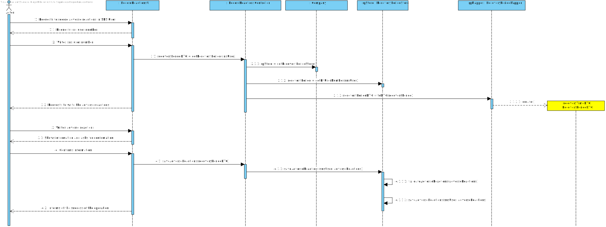
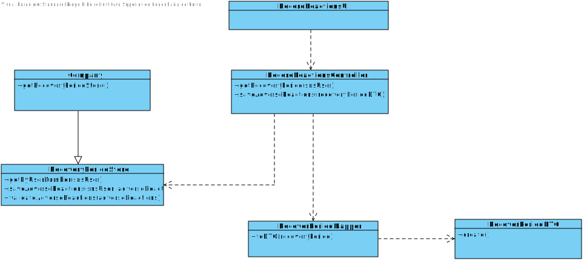

# US 07 - Record adverse reactions of a SNS user

## 1. Requirements Engineering

### 1.1. User Story Description

As a nurse, I intend to record adverse reactions of a SNS user.

### 1.2. Customer Specifications and Clarifications 

**From the specifications document:**

> The application must allow the nurse to record adverse reactions of a SNS user.

**From the client clarifications:**

> **Question:** The SNS User will record the reactions or it's only the nurse?
>
> **Answer:** If the nurse identifies any adverse reactions during that recovery period, the nurse should record the adverse reactions in the system. The nurse must enter the user's SNS number and must describe the adverse reactions.

-

> **Question:** The Nurse must select one SNS User and then write the reactions of that SNS User?
>
> **Answer:** If the nurse identifies any adverse reactions during that recovery period, the nurse should record the adverse reactions in the system. The nurse must enter the user's SNS number and must describe the adverse reactions.

-

> **Question:** When the Nurse will record those reactions?
>
> **Answer:** If the nurse identifies any adverse reactions during that recovery period, the nurse should record the adverse reactions in the system. The nurse must enter the user's SNS number and must describe the adverse reactions.

### 1.3. Acceptance Criteria

* **AC1:** User must be a nurse.
* **AC2:** User must be logged in.
* **AC3:** There must be sns users registered.
* **AC4:** There must be recovery periods registered.

### 1.4. Found out Dependencies

N/A

### 1.5 Input and Output Data

**Input Data:**
	
* Written data:
    * SNS user number
    * Adverse Reactions

**Output Data:**

* (In)Success of the operation

### 1.6. System Sequence Diagram (SSD)

**Other alternatives might exist.**

### 1.7 Other Relevant Remarks

N/A

## 2. OO Analysis

### 2.1. Relevant Domain Model Excerpt 

### 2.2. Other Remarks

N/A

## 3. Design - User Story Realization 

### 3.1. Rationale

| Interaction ID | Question: Which class is responsible for... | Answer                    | Justification (with patterns)                                                                                 |
|:---------------|:--------------------------------------------|:--------------------------|:--------------------------------------------------------------------------------------------------------------|
| Step 1  		     | 	... interacting with the actor?            | RecordReactionsUI         | Pure Fabrication: there is no reason to assign this responsibility to any existing class in the Domain Model. |
| Step 2	  		    | 	... coordinating the US?                   | RecordReactionsController | Controller                                                                                                    |
| Step 3  		     | 	...retrieving all the Recovery Periods?    | RecoveryPeriodStore       | IE: has registered all Recovery Periods                                                                       |
| Step 4 		      | 	 ...transferring the Recovery Period data? | RecoveryPeriodDTO         | Pure Fabrication                                                                                              |
| Step 5  		     | 	... presenting the information?            | EmployeeListUI            | Pure Fabrication                                                                                              | 
| Step 6  		     | 	... informing operation success?           | EmployeeListUI            | Pure Fabrication                                                                                              | 
| Step 7  		     | 	... retrieving the RecoveryPeriodStore?    | Company                   | IE: contains all stores                                                                                       | 

### Systematization ##

According to the taken rationale, the conceptual classes promoted to software classes are: 

 * Company
 * RecoveryPeriod

Other software classes (i.e. Pure Fabrication) identified: 

 * RecoveryPeriodUI 
 * RecoveryPeriodController 
 * RecoveryPeriodStore

## 3.2. Sequence Diagram (SD)

## 3.3. Class Diagram (CD)

# 4. Tests 

# 5. Construction (Implementation)

## Class EmployeeListController 

## Class Employee

# 6. Integration and Demo 

# 7. Observations

