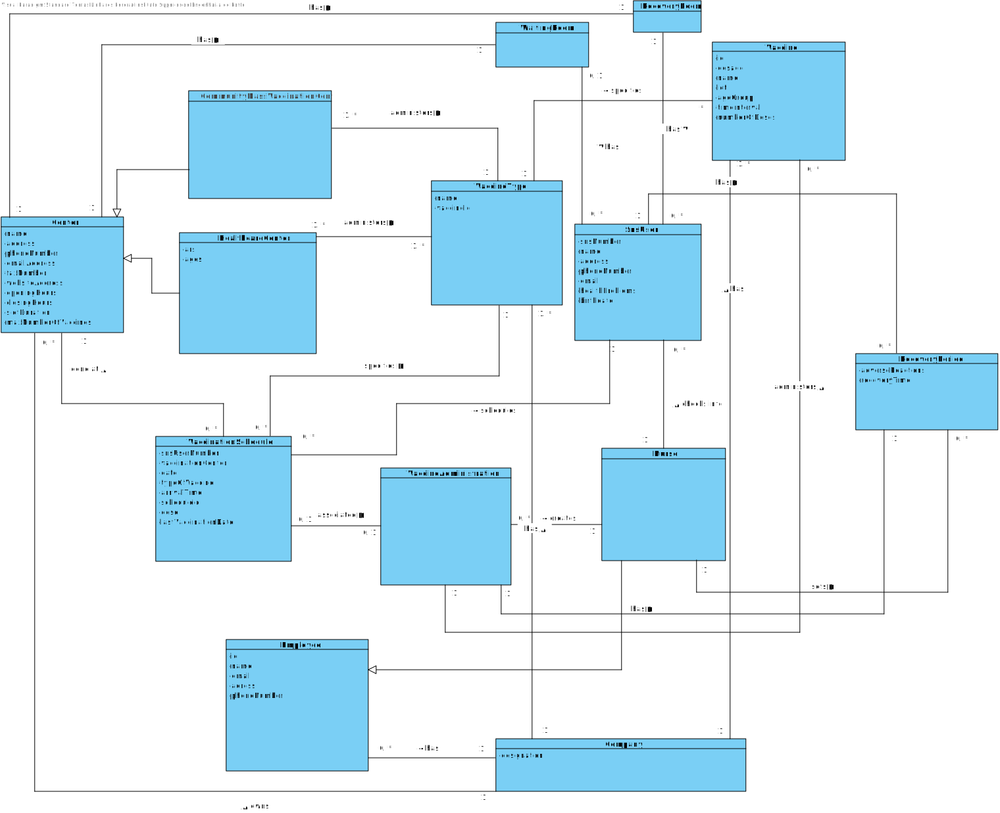

# US08 - vaccineAdminsistration

## 1. Requirements Engineering

### 1.1. User Story Description

As a nurse, I want to record the administration of a vaccine to a SNS User. At the end of the recovery period, the user should receive a SMS message informing the SNS user that he can leave the vaccination center.

### 1.2. Customer Specifications and Clarifications

**From the specifications document:**

> - The system should be able to notify (e.g.: SMS or email) the user that his/her recovery period has ended.
> - After giving the vaccine to the user, each nurse registers the event in the system,
more precisely, registers the vaccine type (e.g.: Covid-19), vaccine name/brand (e.g.: Astra Zeneca,
Moderna, Pfizer), and the lot number used.
> - Afterwards, the nurse sends the user to a recovery room,
to stay there for a given recovery period (e.g.: 30 minutes).
> - The nurse checks the user info and health conditions in the system and in accordance with
the scheduled vaccine type, and the SNS user vaccination history, (s)he gets system instructions
regarding the vaccine to be administered (e.g.: vaccine and respective dosage considering the SNS
user age group)

**From the client clarifications:**

> **Question:** "To access the user info - scheduled vaccine type and vaccination history -, should the nurse enter user's SNS number?"
>
> **Answer:** The nurse should select a SNS user from a list of users that are in the center to take the vaccine.

-

> **Question:** "Supposing that the SNS user has already received a dose of a given vaccine type (for example, COVID-19), the user can only receive the same vaccine or a different one with the same vaccine type?"
>
> **Answer:** The SNS user can only receive the same vaccine.
>
> Related information:
>
> - A SNS user is fully vaccinated when he receives all doses of a given vaccine.
> - A SNS user that has received a single-dose vaccine is considered fully vaccinated and will not take more doses.
> - A SNS user that is fully vaccinated will not be able to schedule a new vaccine of the type for which he is already fully vaccinated.

-

> **Question:** "In US 08 says: "At the end of the recovery period, the user should receive a SMS message informing the SNS user that he can leave the vaccination center." How should the SNS user receive and have access to the SMS message?"
>
> **Answer:** "A file named SMS.txt should be used to receive/record the SMS messages. We will not use a real word service to send SMSs."

### 1.3. Acceptance Criteria

* **AC1:** All required fields must be filled in.
* **AC2:** The user to administrate a vaccine must be in the waiting room.
* **AC3:** There must be at least one vaccine registered for the scheduled vaccine type.
* **AC4:** The nurse should select a vaccine and the administered dose number.
* **AC5:** An SNS User who is fully vaccinated will not take any more doses.

### 1.4. Found out Dependencies

* "US9: As an administrator, I want to register a vaccination center to respond to a certain pandemic.", since there must be at least one center registered in the system
* "US10: As an administrator, I want to register an Employee.", since a Nurse must be registered in the system
* "US12: As an administrator, I intend to specify a new vaccine type", since there must be at least on vaccine type registered in the system
* "US13: As an administrator, I intend to specify a new vaccine and its administration process", since there must be at least on vaccine registered for the scheduled vaccine type
* "US1: As a SNS user, I intend to use the application to schedule a vaccine.", since the user must have scheduled the vaccine administration
* "US4: As a receptionist at a vaccination center, I want to register the arrival of a SNS user to take the vaccine.", since the user must be in the waiting room

### 1.5 Input and Output Data

**Input Data:**

* Typed data:
    * SNSNumber

* Selected data:
    * Vaccine

**Output Data:**

* UI
    * Available vaccines for scheduled vaccine type
* File
    * .txt file representing SMS message send to user

### 1.6. System Sequence Diagram (SSD)

### 1.7 Other Relevant Remarks

* n/a

## 2. OO Analysis

### 2.1. Relevant Domain Model Excerpt

### 2.2. Other Remarks

n/a

## 3. Design - User Story Realization

### 3.1. Rationale

| Interaction ID | Question: Which class is responsible for... | Answer  | Justification (with patterns)  |
|:-------------  |:--------------------- |:------------|:---------------------------- |
| Step 1 |	... interacting with the actor? | VaccineAdministrationUI  |  Pure Fabrication: there is no reason to assign this responsibility to any existing class in the Domain Model.           |
| | ...coordinating the US? | VaccineAdministrationController | Controller
| | ...serving as an intermediary between the UI layer and the Domain layer? | VaccineAdministrationController | Controller: direct communication between UI classes and domain classes must be avoided.
| | ...storing the centers? | CenterStore | Pure Fabrication: in order to promote reuse and to attend High Cohesion and Low Coupling patterns, the CenterStore exists to be responsible for saving and returning the centers.
| | ...returning the center store? | Company | IE: owns/knows all stores
| | ...returning the nurse's center? | CenterStore | IE: owns/knows all centers
| | ...returning the center's waiting list? | Center | IE: owns/knows it's own data
| | ...storing the SNS Users? | SNSUserStore | IE: Pure Fabrication: in order to promote reuse and to attend High Cohesion and Low Coupling patterns, the SNSUserStore exists to be responsible for saving and returning the SNS Users.
| | ...returning the SNSUser's SNS number? | SNSUser | IE: owns/knows it's own data
| | ...storing the vaccination schedules? | VaccinationScheduleStore | Pure Fabrication: in order to promote reuse and to attend High Cohesion and Low Coupling patterns, the VaccinationScheduleStore exists to be responsible for saving and returning the vaccination schedules.
| | ...returning the user's vaccination schedule? | VaccinationScheduleStore | IE: knows/owns all vaccination schedules
| | ...returning the user's vaccine type for the schedule? | VaccinationSchedule | IE: knows/owns it's own data
| | ...storing the vaccine administrations? | VaccineAdministrationStore | Pure Fabrication: in order to promote reuse and to attend High Cohesion and Low Coupling patterns, the VaccineAdministrationStore exists to be responsible for saving and returning the vaccine administrations.
| | ...returning the vaccine administration store? | VaccineAdministrationStore | IE: knows/owns it's own data
| | ...returning the sns user to compare? | VaccineAdministration | IE: knows/owns it's own data
| | ...returning the vaccine to compare? | VaccineAdministration | IE: knows/owns it's own data
| | ...returning the vaccine type ID to compare? | Vaccine | IE: knows/owns it's own data
| | ...returning the vaccine type ID to compare? | VaccineType | IE: knows/owns it's own data
| | ...returning the vaccine type name? | VaccineType | IE: knows/owns it's own data
| | ...returning list of available vaccines? | VaccineStore | IE: knows/owns all vaccines
| | ...mapping available vaccines into a list of vaccine DTOs? | VaccineMapper | PureFabrication: in order to promote reuse and to attend High Cohesion and Low Coupling patterns, the VaccineMapper exists in order to create VaccineDTO's and returning a list of them
| | ...instantiating a new DTO that represents a vaccine list? | VaccineMapper | Creator (Rule 3): VaccineMapper closely uses VaccineListDTO
| | ...returning vaccine information? | Vaccine | IE: knows/owns it's own data
| | ...instantiating a new DTO that represents a vaccine? | VaccineMapper | Creator (Rule 4): VaccineMapper has the data to initialize VaccineDTO.
| | ...returning vaccine list? | VaccineMapper | IE: knows/owns it's own data
| | ...instantiating a new VaccineList? | VaccineAdministrationController | Creator (Rule 4): Controller has the data to initialize VaccineList.
| Step 2 | ...showing a list of available vaccines for the scheduled vaccine type? | VaccineAdministrationUI | UI: responsible for user interaction
| Step 3 | ...selecting the vaccine? | N/A
| Step 4 | ...asking for confirmation? | VaccineAdministrationUI | UI: responsible for user interaction
| Step 5 | ...confirming the operation? | N/A
| | ...getting a vaccine by it's ID? | VaccineStore | IE: knows/owns all vaccines
| | ...instantiating a vaccine administration? | VaccineAdministrationStore | Creator (Rules 1, 2 and 4)
| | ...returning the number of dose? | VaccineAdministration | IE: knows/owns it's own data
| | ...storing user in the waiting list | SNSUserList | Pure Fabrication: in order to promote reuse and to attend High Cohesion and Low Coupling patterns, the SNSUserList exists to be responsible for saving and returning a list of SNSUsers
| | ...removing user from waiting list? | SNSUserList | IE: knows/owns it's own data
| | ...returning recovery room? | Center | IE: knows/owns it's own data
| | ...adding a user to the recovery room? | SNSUserList | IE: knows/owns some SNSUsers
| | ...creating a TimerTask? | VaccineAdministrationController | Creator (Rules 3 and 4)
| | ...creating a Timer? | VaccineAdministrationController | Creator (Rule 3): Controller works closely with Timer
| | ...returning message delay time? | Company | IE: knows data from configuration file
| | ...scheduling a timer? | Timer |
| | ...sending SMS? | SendSMS | PureFabrication: 
| | ...removing snsUser from recovery room | SNSUserList | IE: knows/owns it's own data
| Step 6 | informing (in)success of the operation | VaccineAdministrationUI | UI: responsible for user interaction

### Systematization ##

According to the taken rationale, the conceptual classes promoted to software classes are:

* Company
* Center
* VaccineAdministration
* SNSUser
* VaccinationSchedule
* VaccineType
* VaccineStore
* Vaccine

Other software classes (i.e. Pure Fabrication) identified:

* VaccineAdministrationUI
* VaccineAdministrationController
* CenterStore
* SNSUserList
* VaccineAdministrationStore
* VaccinationScheduleStore
* VaccineStore
* VaccineMapper
* VaccineList
* VaccineListDTO
* VaccineDTO
* SendSMS

## 3.2. Sequence Diagram (SD)

## 3.3. Class Diagram (CD)

